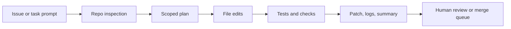

import SupportCTA from "/snippets/support-cta.mdx";

<SupportCTA />

## Summary

Coding agents help turn a software task into a bounded implementation loop:
inspect the repository, propose a change, edit the right files, run checks, and
hand back a diff with verification notes.

The current product signal is strong enough to treat this as a real agent shape,
not just autocomplete with a chat box. OpenAI's Codex positioning now spans a
cloud software-engineering agent plus a local terminal coding agent, which
makes the workflow legible for both teams and individual builders.

## Why It Matters

Coding work has the right mix of structure and uncertainty for agents.

Useful, because the work is already artifact-heavy:

- issue text or bug report
- repository files
- tests and linters
- patch diffs
- review comments

Risky, because the agent can silently make the wrong edit, miss a failing test,
or overreach into unrelated files while still sounding confident.

That makes boundaries more important than raw generation quality. A useful
coding agent is a repo-scoped worker with explicit verification, not a generic
"write some code" assistant.

## Mental Model

A durable coding-agent workflow has five steps:

- `inspect`: read the issue, repo structure, and nearby code before changing anything
- `plan`: decide the smallest file set and validation path
- `change`: edit the scoped files and preserve unrelated local work
- `verify`: run tests, linters, or focused commands that check the claimed fix
- `handoff`: summarize the diff, remaining risks, and next reviewer focus

The key system boundary is not "can the model code?" It is whether the runtime
keeps the agent inside the intended repository, tool, and approval limits while
preserving a readable audit trail.

## Architecture Diagram

## Tool Landscape

Coding agents usually combine:

- repository read access for code, docs, and configuration
- file-edit tools that can produce an inspectable patch
- shell access for tests, formatters, builds, and git inspection
- browser or web access when a task depends on current docs or a running UI
- guardrails for approvals, network access, and destructive commands

OpenAI's current Codex surfaces make this split clearer than many earlier
coding assistants:

- the cloud Codex product frames software tasks as isolated runs with their own
  sandboxed environment and repository preload
- the open-source Codex CLI frames the local path as a terminal coding agent
  with approval modes, MCP access, web search, and cloud-task handoff

That is why coding agents should be taught as an end-to-end system loop, not as
just model output quality.

## Guardrails

Useful defaults for coding agents:

- start from repository inspection, not instant editing
- keep the write scope as small as possible
- preserve unrelated working-tree changes
- require explicit verification before claiming completion
- keep command output, diffs, and test results visible to the reviewer
- treat secrets, production credentials, and destructive git commands as separate approvals

If the environment supports both local and cloud execution, keep the trust
boundary explicit. Local execution can see the developer's real machine state.
Cloud execution is easier to isolate, but it still needs clear repo, secret, and
network policy.

## Tradeoffs

- More autonomy reduces copy-paste work, but it increases the risk of broad
  unintended edits.
- Local execution sees the real repository and environment, but it inherits more
  secrets and workstation risk.
- Cloud sandboxes isolate runs more cleanly, but they can drift from the exact
  local setup if dependencies or secrets differ.
- Fast patch generation feels productive, but a slower repo-inspect and verify
  loop usually produces better changes.

Practical default:

- use a local or cloud coding agent to inspect, patch, and verify
- keep a human in the review loop for merge decisions
- optimize for traceable diffs and reproducible checks instead of one-shot code generation

## Current Product Signal

The current seven-day signal for this handbook run was `OpenAI Codex`, drawn
from stored article coverage and then verified against current first-party docs
and the public GitHub repository.

The reusable lesson is broader than one vendor:

- coding agents are becoming a distinct product category
- the winning shape is repository-first, verification-heavy, and approval-aware
- teams should evaluate them as agent systems with memory, tools, policies, and
  review artifacts, not as pure prompt UX

## Starter Direction

For a practical on-ramp, start with the existing
[Codex Workshop](/workshops/codex). It is
the shortest path in this repo from installation to real repository work.

From there, connect this case study to:

- [Evaluation And Observability](/systems/evaluation-and-observability) for the
  verification and trace loop
- [Context Engineering](/systems/context-engineering) for instruction, state,
  and retrieval boundaries
- [Case Studies Overview](/case-studies) for adjacent product shapes such as
  deep research and customer support agents

## Citations

- Official source: [Introducing Codex](https://openai.com/index/introducing-codex/)
- Official source: [Codex CLI documentation](https://developers.openai.com/codex/cli)
- High-signal repository: [openai/codex](https://github.com/openai/codex)

## Reading Extensions

- [Codex Workshop](/workshops/codex)
- [Evaluation And Observability](/systems/evaluation-and-observability)
- [Context Engineering](/systems/context-engineering)
- [Case Studies Overview](/case-studies)

## Update Log

- 2026-05-03: Added a repo-native coding-agents case study anchored in the
  current OpenAI Codex signal and linked it to the handbook's existing Codex
  workshop.
