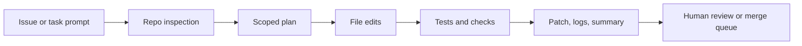

import SupportCTA from "/snippets/support-cta.mdx";

<SupportCTA />

## Summary

Coding agents help turn a software task into a bounded implementation loop:
inspect the repository, propose a change, edit the right files, run checks, and
hand back a diff with verification notes.

The current product signal is strong enough to treat this as a real agent
category, not just autocomplete with a chat box. The category now spans cloud
task runners, local terminal agents, and GitHub-native background PR workers,
which makes the runtime boundary far more important than model branding alone.

## Why It Matters

Coding work has the right mix of structure and uncertainty for agents.

Useful, because the work is already artifact-heavy:

- issue text or bug report
- repository files
- tests and linters
- patch diffs
- review comments

Risky, because the agent can silently make the wrong edit, miss a failing test,
or overreach into unrelated files while still sounding confident.

That makes boundaries more important than raw generation quality. A useful
coding agent is a repo-scoped worker with explicit verification, not a generic
"write some code" assistant.

## Mental Model

A durable coding-agent workflow has five steps:

- `inspect`: read the issue, repo structure, and nearby code before changing anything
- `plan`: decide the smallest file set and validation path
- `change`: edit the scoped files and preserve unrelated local work
- `verify`: run tests, linters, or focused commands that check the claimed fix
- `handoff`: summarize the diff, remaining risks, and next reviewer focus

The key system boundary is not "can the model code?" It is whether the runtime
keeps the agent inside the intended repository, tool, and approval limits while
preserving a readable audit trail.

## Architecture Diagram

## Tool Landscape

Coding agents usually combine:

- repository read access for code, docs, and configuration
- file-edit tools that can produce an inspectable patch
- shell access for tests, formatters, builds, and git inspection
- browser or web access when a task depends on current docs or a running UI
- guardrails for approvals, network access, and destructive commands

OpenAI, Anthropic, and GitHub now expose the same basic system shape with
different operating boundaries:

- OpenAI Codex spans cloud tasks plus a local Codex CLI path, so teams can
  choose between an isolated run and a real local repository session
- Claude Code frames coding work as a terminal-native agent with project memory,
  permissions, MCP access, and optional hooks
- GitHub Copilot coding agent frames the work as background issue or PR
  execution inside GitHub-hosted infrastructure, with repository instructions,
  MCP extensions, and workflow hooks

That is why coding agents should be taught as an end-to-end system loop, not as
just model output quality.

## Instruction Surfaces And Runtime Boundaries

The most useful comparison point is not model quality. It is how each coding
agent makes instructions, tools, and approvals explicit.

| Product shape | Primary runtime | Persistent instruction surface | Tool extension surface | Main trust boundary |
| --- | --- | --- | --- | --- |
| OpenAI Codex | local CLI plus cloud task runners | `AGENTS.md` and Codex config-driven instructions | built-in tools plus MCP | local approval policy or cloud sandbox policy |
| Claude Code | local terminal session or GitHub Action | `CLAUDE.md` plus `.claude/settings.json` | MCP plus hooks | read-only by default, then explicit permission grants |
| GitHub Copilot coding agent | GitHub-hosted background environment | `AGENTS.md`, `.github/copilot-instructions.md`, and path-specific instruction files | MCP plus hooks | repository settings plus ephemeral GitHub execution |

This is the reusable lesson for builders: instruction files are not a minor
prompting detail. They are part of the runtime contract.

## Guardrails

Useful defaults for coding agents:

- start from repository inspection, not instant editing
- keep the write scope as small as possible
- preserve unrelated working-tree changes
- require explicit verification before claiming completion
- keep command output, diffs, and test results visible to the reviewer
- treat secrets, production credentials, and destructive git commands as separate approvals

If the environment supports both local and cloud execution, keep the trust
boundary explicit. Local execution can see the developer's real machine state.
Cloud execution is easier to isolate, but it still needs clear repo, secret, and
network policy.

Good coding-agent reviews should also ask:

- which instruction files the agent loaded for this task
- whether hook or approval policy can stop risky commands before they run
- whether MCP access is narrower than the full shell or filesystem surface
- whether the verification path is automatic enough to catch confident but wrong edits

## Tradeoffs

- More autonomy reduces copy-paste work, but it increases the risk of broad
  unintended edits.
- Local execution sees the real repository and environment, but it inherits more
  secrets and workstation risk.
- Cloud sandboxes isolate runs more cleanly, but they can drift from the exact
  local setup if dependencies or secrets differ.
- Fast patch generation feels productive, but a slower repo-inspect and verify
  loop usually produces better changes.

Practical default:

- use a local or cloud coding agent to inspect, patch, and verify
- keep a human in the review loop for merge decisions
- optimize for traceable diffs and reproducible checks instead of one-shot code generation

## Current Product Signal

The current seven-day stored-article signal for this handbook run was
`coding agents`, not one single vendor release.

The stored article evidence clustered around three practical questions:

- how mainstream "vibe coding" is becoming in tools such as Google AI Studio
- how prompt injection and similar hostile inputs can break coding-agent loops
- how teams increasingly treat background coding-agent runs as a metered,
  reviewable engineering workflow rather than a chat toy

Current official verification reinforces the broader category lesson:

- OpenAI documents Codex as a suite that spans Codex CLI, Codex Cloud, and the
  Codex VS Code extension
- Anthropic documents Claude Code as a terminal coding agent with project
  memory, permission settings, and automation hooks
- GitHub documents Copilot coding agent as a background worker that can take
  issues or PR work, apply repository instructions, and use MCP and hooks

The reusable lesson is now clearer than it was earlier in May:

- coding agents are a distinct agent category, not just "better autocomplete"
- instruction files such as `AGENTS.md`, `CLAUDE.md`, and repository
  instruction files are first-class operating surfaces
- the winning product shape is repository-first, verification-heavy,
  approval-aware, and explicit about where the agent is running

## Starter Direction

For a practical on-ramp, start with the existing
[Codex Workshop](/workshops/codex). It is
the shortest path in this repo from installation to real repository work.

From there, connect this case study to:

- [Evaluation And Observability](/systems/evaluation-and-observability) for the
  verification and trace loop
- [Context Engineering](/systems/context-engineering) for instruction, state,
  and retrieval boundaries
- [Local Agent Tooling Source Map](/contributor-kit/reference-notes/local-agent-tooling-source-map)
  for repo-native guidance on roots, resources, and local-agent security
- [Case Studies Overview](/case-studies) for adjacent product shapes such as
  deep research and customer support agents

## Citations

- Official source: [Unrolling the Codex agent loop](https://openai.com/index/unrolling-the-codex-agent-loop)
- Official source: [Claude Code overview](https://docs.anthropic.com/en/docs/claude-code/overview)
- Official source: [Claude Code settings](https://docs.anthropic.com/en/docs/claude-code/settings)
- Official source: [About GitHub Copilot coding agent](https://docs.github.com/en/copilot/concepts/about-copilot-coding-agent)
- Official source: [Adding repository custom instructions for GitHub Copilot](https://docs.github.com/en/copilot/customizing-copilot/adding-repository-custom-instructions-for-github-copilot)
- Official source: [Extending GitHub Copilot cloud agent with MCP](https://docs.github.com/en/copilot/how-tos/agents/copilot-coding-agent/extending-copilot-coding-agent-with-mcp)
- High-signal repository: [openai/codex](https://github.com/openai/codex)
- High-signal repository: [anthropics/claude-code-action](https://github.com/anthropics/claude-code-action)

## Reading Extensions

- [Codex Workshop](/workshops/codex)
- [Evaluation And Observability](/systems/evaluation-and-observability)
- [Context Engineering](/systems/context-engineering)
- [Local Agent Tooling Source Map](/contributor-kit/reference-notes/local-agent-tooling-source-map)
- [Case Studies Overview](/case-studies)

## Update Log

- 2026-05-31: Refreshed the page from an older single-vendor Codex snapshot
  into a broader coding-agent category note covering instruction files,
  permissions, MCP, hooks, and verification boundaries across OpenAI,
  Anthropic, and GitHub.
- 2026-05-03: Added a repo-native coding-agents case study anchored in the
  current OpenAI Codex signal and linked it to the handbook's existing Codex
  workshop.
