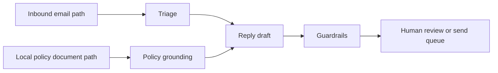

import SupportCTA from "/snippets/support-cta.mdx";

<SupportCTA />

## Summary

Customer support agents help turn inbound customer messages into classified
cases, grounded answers, draft replies, and human handoffs. The safest version
is not an autonomous "reply to everything" bot.

Start with a local, policy-grounded workflow: read one customer input, consult
approved support material, draft a response, and leave the final send decision
to a human.

## Why It Matters

Support work is repetitive enough to benefit from agents, but sensitive enough
to require tight boundaries.

Useful, because many messages share patterns:

- product questions
- billing questions
- complaints
- refund or replacement requests
- account and privacy requests

Risky, because a bad reply can promise the wrong remedy, expose private
information, mishandle angry customers, or ignore escalation rules.

## Mental Model

A durable customer-support agent has five steps:

- `ingest`: read the inbound message from an email, form, chat export, or CRM
  record
- `classify`: identify the case type, urgency, sentiment, and requested outcome
- `ground`: retrieve the relevant local policy, FAQ, refund rule, or escalation
  note
- `draft`: produce a customer-facing reply that cites only approved support
  material
- `gate`: decide whether the reply is safe to send or needs human review

The local document path is important. It makes the policy source explicit:

```text
EMAIL_PATH=/Users/example/inbox/customer-complaint.txt
POLICY_PATH=/Users/example/support/refund-and-escalation-policy.md
```

That is a clearer system than asking a model to "answer like support" from
general memory.

For this case study, the boundary is the main lesson:

- the email path is the customer input
- the policy path is the approved source of truth
- the draft is an artifact for review
- the human owns the final decision

## Architecture Diagram



## Tool Landscape

Support agents usually combine a small set of capabilities:

- local file reading for approved policy and FAQ documents
- mailbox or CRM connectors for inbound customer messages
- classification logic for routing and escalation
- retrieval or search over support material
- draft generation with tone and policy constraints
- audit output that shows which policy evidence informed the reply

For a starter workflow, a local path is enough. The agent can read one inbound
message file and one policy document file. Production systems can later replace
those local paths with Gmail, helpdesk, CRM, or MCP-backed resources, but the
same boundary should stay visible.

MCP-style roots and resources are useful here because they force the system to
say what the agent may access. A policy folder root is different from full disk
access. A selected policy resource is different from crawling every customer
record.

## Guardrails

Good support agents should not send replies automatically unless the operating
rules are extremely narrow.

Useful defaults:

- never promise refunds, credits, replacements, legal outcomes, or account
  changes unless the local policy explicitly allows them
- always escalate chargebacks, safety issues, abusive messages, privacy
  requests, and regulatory questions
- include the policy evidence used to draft the reply
- keep the reply calm, short, and customer-facing
- treat "not enough policy evidence" as a valid reason for human review

## Tradeoffs

- Local policy grounding improves control, but the policy document must be kept
  current.
- A narrow draft-only workflow is safer, but it still needs review capacity.
- Rich mailbox integrations reduce copy-paste work, but they expand privacy
  and permission risks.
- Automated replies improve speed, but they can harm trust if classification or
  policy grounding is weak.

Practical default:

- start with draft-only replies from explicit local document paths
- add mailbox integration only after the policy-grounded draft loop is reliable
- add auto-send only for low-risk, high-confidence cases with clear audit logs

## Starter Projects

Two starter projects sit on this case-study path:

- [Customer Support Email Agent Starter](/case-studies/examples/customer-support-email-agent-starter):
  a smaller draft-only workflow for loading a local email, loading a local
  policy, classifying complaints, queries, refund requests, and handoff cases,
  then drafting a safe policy-grounded reply.
- [Customer Email Assist Starter](/case-studies/examples/customer-email-assist-starter):
  a mailbox-integrated follow-on starter for Gmail sync, local SQLite issue
  queues, customer review, deterministic send-queue execution, and a dashboard
  for editing and approving replies.

## Citations

- Official source: [OpenAI computer environment for agents](https://openai.com/index/equip-responses-api-computer-environment/)
- Official source: [OpenAI Responses API tools and file search](https://openai.com/index/new-tools-and-features-in-the-responses-api/)
- Official source: [Claude Code MCP documentation](https://code.claude.com/docs/en/mcp)
- Official source: [MCP roots](https://modelcontextprotocol.io/specification/2025-06-18/client/roots)
- Official source: [MCP resources](https://modelcontextprotocol.io/specification/2025-06-18/server/resources)

## Reading Extensions

- [Protocols And Interoperability](/systems/protocols-and-interoperability)
- [Agent Memory And Retrieval](/patterns/agent-memory-and-retrieval)
- [Case Studies Overview](/case-studies)

## Update Log

- 2026-04-24: Refined the case study for readability and made the local input,
  policy source, review artifact, and human decision boundary more explicit.
- 2026-04-23: Added a local-first customer-support case study with a
  policy-grounded email reply starter.
