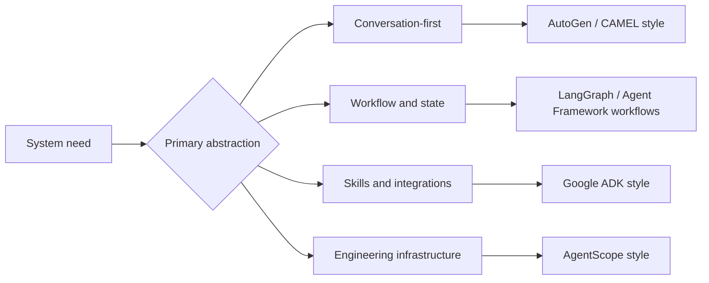

import SupportCTA from "/snippets/support-cta.mdx";

<SupportCTA />

## Summary

Agent frameworks package recurring runtime problems such as state, tools,
message passing, and control flow. In 2026, the most useful comparison question
is no longer just "chat loop or graph?" It is "which abstraction owns the
work: conversation, explicit workflows, engineering infrastructure, or
load-on-demand skills and integrations?"

## Why It Matters

Teams usually reach for a framework after the first manual prototype starts to
hurt. The pain is familiar:

- duplicated agent loop code
- unclear state handling
- brittle tool wiring
- weak observability
- hard-to-debug multi-agent coordination

The framework market is now converging and branching at the same time.
Microsoft is folding AutoGen and Semantic Kernel ideas into Agent Framework.
Google ADK is pushing a skill-and-integration-first model. Older frameworks
still matter, but the comparison surface is wider than the original
conversation-versus-graph split.

## Mental Model

Six anchors help orient the current landscape:

- `AutoGen`: conversation-first collaboration
- `CAMEL`: lightweight role-driven collaboration
- `LangGraph`: graph-structured control flow and recoverable state
- `Microsoft Agent Framework`: unified agents plus explicit workflows
- `Google ADK`: code-first agents with skills and integrations loaded on demand
- `AgentScope`: engineering-first multi-agent infrastructure

These are not direct substitutes. They reflect different control centers:

- conversation-first frameworks optimize collaboration as dialogue
- graph-first frameworks optimize explicit state transitions and orchestration
- skill-first frameworks optimize reusable expertise and tool ecosystems
- engineering-first frameworks optimize runtime discipline and production
  concerns

## Architecture Diagram

## Tool Landscape

### Global coverage

- AutoGen remains useful when a system should behave like a coordinated group
  of specialists exchanging messages.
- CAMEL remains useful when role pairing and autonomous collaboration matter
  more than heavy orchestration.
- LangGraph remains useful when loops, checkpoints, and recoverable state
  transitions need to be explicit.
- Microsoft Agent Framework matters because it combines agent abstractions with
  enterprise features such as state management, middleware, telemetry, and
  graph-based workflows. It is the clearest current signal that the AutoGen and
  Semantic Kernel lines are being pulled into a shared successor.
- Google ADK matters when agents should load expertise through skills and then
  connect quickly to external tools, partner platforms, and cloud services.

### China-linked coverage

- AgentScope remains the clearest engineering-first reference in the current
  China-linked set, with stronger emphasis on large-scale coordination, runtime
  infrastructure, and production operations.

### Selection criteria

- Choose conversation-first frameworks when collaborative behavior is the main
  abstraction.
- Choose graph-first frameworks when explicit control flow, checkpointing, or
  mixed agent-function orchestration matters most.
- Choose skill-first frameworks when reusable domain instructions and external
  integrations are central to the design.
- Choose engineering-first frameworks when operational rigor arrives early and
  the team expects multi-agent systems to behave like software infrastructure,
  not just prompts.
- If the task is deterministic enough to be a workflow or plain function, do
  not force it into an autonomous agent abstraction.

## Tradeoffs

- Conversation-oriented frameworks feel natural for collaboration, but they can
  be harder to constrain and debug.
- Graph-oriented frameworks are easier to reason about operationally, but they
  require more explicit design work upfront.
- Skill-first frameworks reduce monolithic prompts and speed up reuse, but they
  introduce another packaging and evaluation boundary.
- Engineering-heavy frameworks help when production requirements arrive early,
  but they can be excessive for small prototypes.

Useful defaults:

- start from the control model, not brand familiarity
- prefer workflows or plain functions for deterministic tasks
- keep framework choice aligned with product surface and team capability
- treat integrations and skills as first-class architecture, not afterthoughts

## Citations

- Current official framework readings are listed in `external_readings`.

## Reading Extensions

- [Framework Comparison](/ecosystem/framework-comparison): beginner-friendly
  guide to choosing between LangChain, LlamaIndex, and no framework at all.
- [Reasoning And Control Patterns](/patterns/reasoning-and-control-patterns)
- [Planning And Reflection](/patterns/planning-and-reflection)
- [Ecosystem Overview](/ecosystem)

## Update Log

- 2026-04-23: Refreshed the page with current Microsoft Agent Framework and
  Google ADK signals.
- 2026-04-21: Initial repo-native draft based on imported reference material
  and lab rewrite rules.
