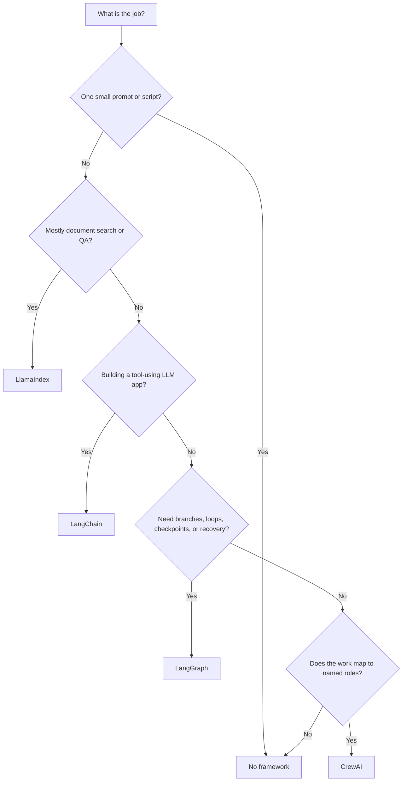

import SupportCTA from "/snippets/support-cta.mdx";

<SupportCTA />

## Summary

AI frameworks package repeatable LLM application work: prompts, tool calls,
retrieval, state, routing, retries, and observability. They exist because the
first demo is often simple, but the second and third feature quickly create
the same engineering problems again.

A practical default for beginners is: **start with the smallest thing that
solves the job, then adopt a framework when the project needs structure that
is no longer easy to maintain manually.**

## Why It Matters

A direct API call is enough when the task is a single prompt, a small script,
or a prototype where you can see every step. A framework starts to make sense
when the project needs:

- **memory** across turns or sessions
- **retrieval** from documents, databases, or private knowledge bases
- **tool use** such as search, database queries, calendar actions, or code
- **stateful control flow** with branches, loops, retries, or checkpoints
- **collaboration patterns** where several roles or agents divide the work
- **observability** so failures can be traced and improved

A common over-engineering pattern is adopting a framework before the project
needs one. That can turn a small learning project into dependency management,
new vocabulary, and more difficult debugging. The right question is not "which
framework is best?" It is:

> Which part of my current project is becoming repetitive, fragile, or hard to
> reason about?

## Mental Model

Think of framework choice like choosing between writing a script, using an app
starter kit, or using a workflow engine:

| Option | Everyday analogy | What it means |
| --- | --- | --- |
| **No framework** | Writing a checklist by hand | You call the LLM API directly and write the prompt, state handling, tool calls, and error handling yourself. This is best when the workflow is small and visible. |
| **LlamaIndex** | A library catalog and reference desk | It helps ingest, index, search, and answer questions over documents. Use it when the main job is connecting an LLM to private data. |
| **LangChain** | An application starter kit for LLM apps | It gives reusable pieces for models, prompts, tools, agents, streaming, and integrations. Use it when you are building a broader LLM application with tools or multiple steps. |
| **LangGraph** | A workflow engine or state machine | It makes steps, branches, loops, checkpoints, and recovery explicit. Use it when control flow matters more than quick setup. |
| **CrewAI** | A small project team with assigned roles | It models agents as role-based collaborators with tasks. Use it when the problem naturally fits a planner/researcher/writer/reviewer style of division. |

## Comparison Table

| Dimension | No framework | LlamaIndex | LangChain | LangGraph | CrewAI |
| --- | --- | --- | --- | --- | --- |
| **Purpose** | Direct LLM calls with manual control | Data ingestion, indexing, retrieval, and document QA | General LLM app and agent development | Stateful graph orchestration | Role-based multi-agent task execution |
| **Complexity** | Low | Low to moderate | Moderate | Moderate to high | Moderate |
| **Best use cases** | Learning, demos, one-off scripts, simple assistants | RAG, knowledge bases, document search, internal QA | Chatbots with tools, agent apps, reusable integrations | Long-running workflows, loops, checkpoints, human review, recovery | Research, writing, analysis, or operations tasks split across roles |
| **What it saves you from writing** | No framework layer; you implement the pieces directly | Loaders, indexes, retrievers, query flows | Model/tool/prompt wiring, agent harnesses, integrations | State transitions, branching, persistence, resumability | Role/task setup and delegation patterns |
| **When to avoid** | When state, retrieval, or tools are growing | When documents are not central | When a direct API call is enough | When the workflow is linear and short | When one agent or a plain workflow is enough |

## Scenario Walkthroughs

### Scenario 1: Simple chatbot

- **No framework**: store the message list, call the model, and return the
  answer. This is usually enough for a prototype.
- **LangChain**: becomes useful when the chatbot needs tool calls, structured
  outputs, streaming, tracing, or reusable prompt/model wiring.
- **Verdict**: start without a framework. Move to LangChain when the chatbot
  becomes an application rather than a single chat loop.

### Scenario 2: Document QA over internal PDFs

- **No framework**: parse files, chunk text, create embeddings, store vectors,
  retrieve relevant chunks, assemble context, and handle citations yourself.
- **LlamaIndex**: provides a focused path for loading documents, building an
  index, and querying over private data.
- **LangChain**: can also build retrieval flows, especially when retrieval is
  one part of a broader tool-using agent.
- **Verdict**: choose LlamaIndex when document retrieval is the core product;
  choose LangChain when retrieval is one tool inside a larger agent app.

### Scenario 3: Multi-step research workflow

- **LangGraph**: model the process as explicit nodes such as plan, search,
  synthesize, review, and revise. Use checkpoints when the workflow may need
  to pause, resume, or recover.
- **CrewAI**: model the process as roles such as planner, researcher, writer,
  and editor, each with a task.
- **Verdict**: choose CrewAI for a fast role-based prototype; choose LangGraph
  when execution control and state are the main risks.

## Useful Defaults

- Use **no framework** for the first working version unless retrieval, tools,
  or state already dominate the problem.
- Use **LlamaIndex** when the question is "how do I make this data searchable
  and answerable by an LLM?"
- Use **LangChain** when the question is "how do I build an LLM application
  that connects models, prompts, tools, and integrations?"
- Use **LangGraph** when the question is "how do I control and recover a
  multi-step process?"
- Use **CrewAI** when the question is "how do I divide this work across named
  agent roles?"
- If a task is deterministic, use a normal function or workflow. Add an agent
  only when it provides useful coordination, tool use, or decision-making.

## Citations

- [LangChain documentation](https://docs.langchain.com/oss/python/langchain/overview)
- [LlamaIndex documentation](https://developers.llamaindex.ai/python/framework/)
- [LangGraph documentation](https://docs.langchain.com/oss/python/langgraph/overview)
- [CrewAI documentation](https://docs.crewai.com/)
- Current official readings are listed in `external_readings`.

## Reading Extensions

- [Agent Frameworks](/ecosystem/agent-frameworks): intermediate-level comparison
  of conversation-first, graph-first, skill-first, and engineering-first
  frameworks.
- [Agent Runtime Building Blocks](/patterns/agent-runtime-building-blocks):
  the runtime primitives that frameworks wrap.
- [Ecosystem Overview](/ecosystem): the full ecosystem lane.

## Update Log

- 2026-06-02: Revised into a beginner decision guide with current official
  links, clearer mental models, and less API-specific guidance.
- 2026-05-04: Initial draft for beginner-oriented framework comparison.
