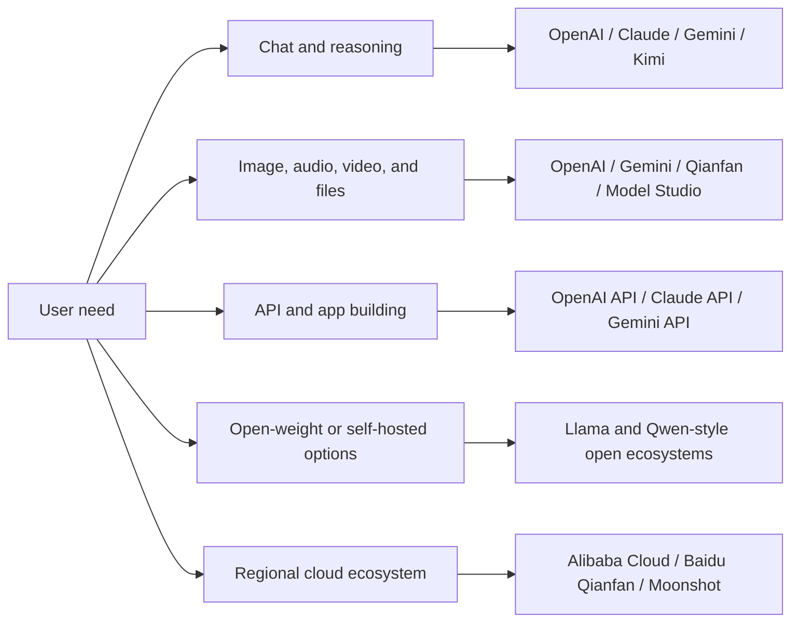

import SupportCTA from "/snippets/support-cta.mdx";

<SupportCTA />

## Summary

The model ecosystem is easier to understand when it is grouped by what a
learner can do with each family: chat and reasoning, multimodal input,
generation, open-weight deployment, or regional cloud access. This page is a
high-level map for choosing a starting point, not a benchmark ranking.

## Why It Matters

Students and early builders often hear model names before they understand the
product shape behind them. A useful map should answer four questions:

- What kind of work can this model family support?
- How do I access it: consumer app, API, open weights, or cloud platform?
- Is it better for learning, prototyping, or deployment?
- What should I check before using it in a real project?

## Architecture Diagram

## Provider Map

| Provider family | What students should remember | Common access pattern | Good first use |
| --- | --- | --- | --- |
| OpenAI | Broad model platform across text, reasoning, image, audio, video, realtime, and agentic development surfaces. | ChatGPT for app use; OpenAI API for builders. | General assistants, coding help, multimodal prototypes, and agent workflows. |
| Anthropic Claude | Strong document, reasoning, coding, and workspace-oriented assistant family with API and app surfaces. | Claude app and Claude API. | Long-document review, careful writing, coding assistance, and artifact-style outputs. |
| Google Gemini | Google model family with API access and strong integration with Google AI Studio and Google Cloud surfaces. | Gemini app, Google AI Studio, Gemini API, and cloud deployment paths. | Multimodal experiments, search-grounded prototypes, and Google-stack applications. |
| Meta Llama | Open-weight model ecosystem that can be accessed through Meta and partner channels. | Download, partner hosting, or cloud/provider APIs. | Learning open-weight tradeoffs, local experimentation, and portability-minded builds. |
| Alibaba Cloud Qwen / Model Studio | China-linked model platform with Qwen, multimodal options, coding models, and OpenAI-compatible API patterns. | Alibaba Cloud Model Studio and DashScope-style API access. | China-aware app prototypes, Qwen experiments, and cloud-hosted model access. |
| Baidu Qianfan / ERNIE | China cloud model platform covering ERNIE, DeepSeek, Qwen-linked options, multimodal generation, search, and app builder surfaces. | Baidu Qianfan ModelBuilder and AppBuilder. | Chinese-language product experiments, enterprise app building, and multimodal exploration. |
| Moonshot Kimi | Kimi API family with long-context text and vision-oriented model options. | Kimi app and Moonshot API. | Chinese-language long-context work, document review, and early API experiments. |

## Capability Map

| Capability | What it means | Typical model families to inspect |
| --- | --- | --- |
| Chat and reasoning | Answers questions, drafts text, explains concepts, plans, and solves multi-step tasks. | OpenAI, Claude, Gemini, Kimi, Qianfan, Model Studio. |
| Vision and file understanding | Reads images, screenshots, diagrams, PDFs, and other uploaded materials. | OpenAI, Claude, Gemini, Qianfan, Model Studio, Kimi vision options. |
| Image, audio, and video generation | Creates or transforms media rather than only reading it. | OpenAI specialized models, Gemini ecosystem tools, Qianfan, Model Studio. |
| Tool use and agent workflows | Calls functions, uses tools, or connects to external systems. | OpenAI API, Claude API, Gemini API, Model Studio, Qianfan. |
| Open-weight deployment | Lets teams study, host, tune, or run models outside a single hosted app. | Llama, Qwen open-source editions, and partner-hosted open model catalogs. |
| Regional platform access | Helps teams match language, compliance, data residency, billing, and local ecosystem needs. | Alibaba Cloud Model Studio, Baidu Qianfan, Moonshot Kimi, cloud partners. |

## Choosing A Starting Point

Use the simplest surface that teaches the right lesson.

- For first exposure, start with a consumer assistant such as ChatGPT, Claude,
  Gemini, or Kimi and focus on task design.
- For API learning, start with one model provider and build a small
  request-response app before comparing vendors.
- For multimodal learning, test one input type at a time: image, document,
  audio, or video.
- For open-weight learning, start with why portability, local control, or
  licensing matters before selecting a model.
- For China-linked deployment, inspect Qianfan, Model Studio, and Kimi from the
  beginning instead of treating them as late substitutes.

## Common Mistakes

- Treating the newest model name as automatically better for every task.
- Comparing app features with API features as if they are the same product.
- Ignoring pricing, rate limits, region availability, safety policy, and data
  controls until after a prototype works.
- Choosing an open-weight model for portability without budgeting for hosting,
  evaluation, monitoring, and updates.
- Choosing a regional platform only for language coverage instead of checking
  deployment, billing, and support requirements.

## Suggested Class Exercise

Pick one task, such as "summarize a course reading and produce a study quiz."
Ask students to compare three access patterns:

- a consumer assistant
- a hosted API
- an open-weight or regional cloud option

The output should be a short table: task quality, ease of setup, cost or usage
limits, and what a production team would need to verify next.

## Citations

- Current official model and platform readings are listed in `external_readings`.

## Reading Extensions

- [Agent Platforms And Low-Code Builders](/ecosystem/agent-platforms-and-low-code-builders)
- [LLM Foundations For Agent Systems](/foundations/llm-foundations-for-agent-systems)
- [Evaluation And Observability](/systems/evaluation-and-observability)

## Update Log

- 2026-05-19: Added the beginner model ecosystem map from issue #27.
