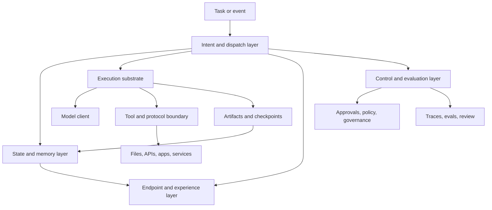

import SupportCTA from "/snippets/support-cta.mdx";

<SupportCTA />

## Summary

Agent runtimes are still built from recurring components, but the practical
boundary has widened. A modern runtime is not only a loop that calls a model.
It now often includes a controlled workspace, explicit tool and protocol
boundaries, durable state, policy and evaluation hooks, and one or more user
surfaces where the agent appears.

That shift matters because the current product signal is no longer "agent
inside a chat box." It is agents working across files, tools, apps, and even
agent-first devices.

## Why It Matters

Most agent systems still converge on the same core runtime questions:

- how messages are represented
- where state lives
- how tools are registered and called
- how loops stop or retry
- how errors surface

But current launches add a second layer of questions:

- where execution actually runs
- how the runtime is governed across agents and endpoints
- how long-running work is checkpointed and resumed
- how adaptive user surfaces stay inspectable and safe
- how traces become usable for evaluation and review

Understanding both layers makes frameworks easier to compare and custom systems
easier to design.

## Current Product Signal

The strongest current signal behind this page is `agent-first computing`.

- Microsoft Build 2026 positioned `Project Solara` as a chip-to-cloud platform
  for agent-first devices, where the "operating system" spans edge hardware,
  cloud state, adaptive UI, and enterprise control.
- Microsoft paired that device signal with runtime-governance and trust work:
  open control surfaces, behavior eval tooling, and security guidance for agent
  systems.
- OpenAI's updated Agents SDK pushed in the same direction from the developer
  runtime side: model-native harnesses, controlled sandboxes, persistent
  workspaces, and isolated execution for long-horizon tasks.

The reusable lesson is broader than one vendor term. Runtime design is moving
up from "call model, call tool, return text" toward "coordinate execution,
state, policy, and endpoints across a real system."

## Mental Model

A practical runtime now usually needs six layers:

- `intent and dispatch layer`: the entry point that receives a task, picks a
  workflow, and decides whether subagents or parallel work are needed
- `state and memory layer`: conversation history, working memory, durable
  artifacts, checkpoints, and retrieval handles
- `execution substrate`: the workspace, sandbox, container, or hosted
  environment where the agent can actually do work
- `tool and protocol boundary`: tool registration plus protocol surfaces such
  as MCP or A2A-style coordination
- `control and evaluation layer`: policy enforcement, approvals, runtime
  governance, trace capture, and behavior-specific eval hooks
- `endpoint and experience layer`: the user-facing surface, whether that is a
  chat panel, terminal, browser, desktop app, badge, or desk companion

The important design choice is not the class hierarchy. It is whether those
responsibilities stay separated enough that the system can evolve without
collapsing runtime policy, product UI, and business logic into one opaque loop.

## Architecture Diagram

## What Changed In 2026

Three changes are making runtime boundaries more visible:

- `adaptive endpoints`: agents are no longer assumed to live inside one fixed
  app shell. The endpoint may be a terminal, a desktop surface, or a
  device-specific interface that shows just-in-time UI.
- `controlled execution`: production-minded agent systems are increasingly
  explicit about sandboxes, workspaces, file scope, and resume points rather
  than treating execution as an invisible helper.
- `runtime governance`: teams increasingly need policy and evaluation to follow
  the agent loop itself, not only the final answer text.

That is why runtime design should now be taught as a systems pattern, not just
as framework plumbing.

## Healthy Defaults

Healthy runtime designs usually share a few traits:

- messages are standardized early so history and traces remain compatible
- execution happens in a controlled workspace rather than in an implicit,
  unlimited environment
- tools are self-describing enough for the runtime, model, and reviewer to
  understand their boundaries
- state handling is explicit rather than hidden in global side effects
- approvals, policy checks, and evaluation hooks live near the runtime rather
  than as afterthoughts
- failures carry structured information instead of generic text blobs
- user endpoints stay downstream of runtime state instead of owning the system

The most reusable runtimes also avoid burying product policy inside the core
execution layer. The runtime should move work, not silently decide business
rules.

## Implementation Checklist

If you are designing or reviewing an agent runtime, check for these defaults:

- isolate execution with a sandbox, container, or similarly bounded workspace
- make tool and protocol boundaries explicit enough to inspect and test
- treat memory as artifacts plus retrievable state, not only hidden chat
  history
- capture traces that let you evaluate behavior, not only output quality
- keep the control plane portable enough that the same policies can apply
  across local, cloud, and device endpoints
- design UI surfaces as clients of the runtime, not as the runtime itself

## Tradeoffs

- Heavier runtime structure makes governance and portability easier, but it can
  also make local debugging slower and more abstract.
- Very lightweight runtimes are easy to read, but they collapse quickly when
  tool boundaries, state, and review surfaces are not separated.
- Adaptive endpoint surfaces reduce the need for one app per workflow, but they
  increase the pressure to keep traceability and permission boundaries clear.
- A unified control plane helps enterprise governance, but it can bottleneck
  local autonomy if every action becomes centrally mediated.
- A unified tool interface helps portability, but only if it does not erase the
  real constraints of each tool boundary.

Useful defaults:

- keep the runtime thin
- keep business decisions outside the core loop when possible
- standardize messages, checkpoints, and errors early
- make tool registration and environment grants explicit enough to inspect and
  test

## Citations

- Official source: [Microsoft Build 2026](https://news.microsoft.com/build-2026/)
- Official source: [Composing a new platform for agent-first devices](https://commandline.microsoft.com/project-solara-build-2026/)
- Official source: [Turn specs into evals for any agent with ASSERT](https://commandline.microsoft.com/assert-written-intent-executable-evals/)
- Official source: [Microsoft Build 2026: Securing code, agents, and models across the development lifecycle](https://www.microsoft.com/en-us/security/blog/2026/06/02/microsoft-build-2026-securing-code-agents-and-models-across-the-development-lifecycle/)
- Official source: [The next evolution of the Agents SDK](https://openai.com/index/the-next-evolution-of-the-agents-sdk/)
- Official source: [From model to agent: Equipping the Responses API with a computer environment](https://openai.com/index/equip-responses-api-computer-environment/)
- High-signal repository: [openai/openai-agents-python](https://github.com/openai/openai-agents-python)
- High-signal repository: [openai/codex](https://github.com/openai/codex)
- High-signal repository: [responsibleai/ASSERT](https://github.com/responsibleai/ASSERT)

## Reading Extensions

- [Agent Memory And Retrieval](/patterns/agent-memory-and-retrieval)
- [Reasoning And Control Patterns](/patterns/reasoning-and-control-patterns)
- [Context Engineering](/systems/context-engineering)
- [Evaluation And Observability](/systems/evaluation-and-observability)
- [April 2026 Local Agent Watch](/radar/2026-04-local-agent-watch)
- [Coding Agents](/case-studies/coding-agents)
- [Agent Frameworks](/ecosystem/agent-frameworks)
- [Patterns Overview](/patterns)

## Update Log

- 2026-06-03: Refreshed the page around agent-first computing, controlled
  execution, runtime governance, and evaluation-aware endpoint design.
- 2026-04-21: Initial repo-native draft based on imported reference material and lab rewrite rules.
