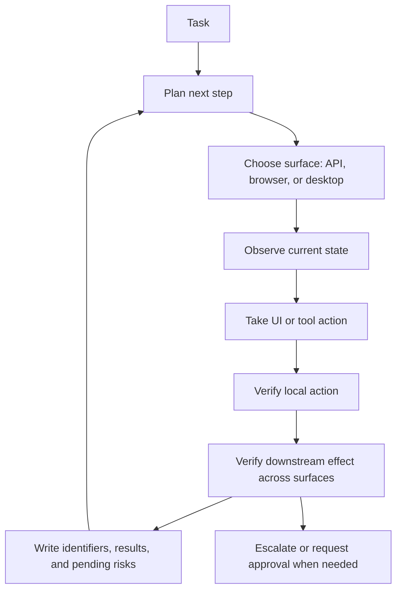

import SupportCTA from "/snippets/support-cta.mdx";

<SupportCTA />

## Summary

Browser-use and computer-use patterns let an agent operate through an existing
user interface instead of through a clean API alone. In the narrower case, the
surface is a browser tab with forms, buttons, tables, and page transitions. In
the broader case, the surface can extend to a full desktop environment with
multiple apps, files, dialogs, and operating-system state.

These patterns matter when a workflow is real but the integration boundary is
messy: the API is incomplete, unavailable, or slower to adopt than the human
interface already in use. The design problem is not only whether the agent can
click the right thing. It is whether the system can observe the interface
clearly, act within permission limits, verify the intended downstream effect
across surfaces, and carry the right state into the next step.

## Why It Matters

Many practical workflows still live behind user interfaces:

- internal tools with weak or missing APIs
- browser-first operations such as order handling, booking, and data entry
- desktop workflows that span a browser, an inbox, a spreadsheet, and a local
  file system
- hybrid tasks where one step is easier through an API but another still needs
  UI interaction

That makes browser or computer use tempting, but also risky.

Unlike a narrow API call, UI-grounded work has to deal with:

- visual ambiguity
- layout drift
- auth and session expiry
- prompt injection inside rendered content
- accidental destructive actions
- success signals that look green locally while the real downstream effect
  failed elsewhere

The pattern is therefore useful only when the runtime treats UI action as a
bounded systems problem rather than as "tool use with screenshots attached."

## Mental Model

The cleanest mental model is not just `observe -> act -> verify`. It is:

- `observe the current surface`: what does the agent actually see right now?
- `choose the execution boundary`: should the next step use the browser, the
  desktop, an API, or a different tool altogether?
- `act on the chosen surface`: click, type, scroll, select, upload, download,
  or switch apps
- `verify the local action`: did the button click land, did the field update,
  did the page change, did the dialog open?
- `verify the downstream effect`: did the email send, did the record update,
  did the order submit, did the external system reflect the intended change?
- `carry forward the right state`: preserve identifiers, confirmations, and
  pending risks before the next step or handoff

That extra downstream verification step matters because real workflows often
span more than one surface. A browser action may trigger an API-side process, a
queue update, a file write, or a follow-up task in another tool. If the agent
checks only the immediate UI feedback, it can falsely conclude that the task is
complete.

A useful distinction:

- `browser use`: interaction with one or more web pages through DOM-aware tools,
  screenshots, accessibility trees, or browser automation primitives
- `computer use`: interaction with a broader desktop environment where the
  browser is only one surface among several

Useful default:

- prefer APIs or structured tools when they are reliable and available
- use browser patterns when the browser is the most practical bounded surface
- use broader computer-use patterns only when the workflow truly spans multiple
  applications or operating-system state

## Architecture Diagram

The design point is simple: local UI confirmation and end-to-end task
confirmation are different checks, and strong systems keep both visible.

## Tool Landscape

This pattern can be implemented through several surface types:

- `browser automation frameworks`: tools such as Playwright that expose the web
  surface through selectors, events, and test-style browser control
- `browser-agent wrappers`: tools such as Browser Use that add agent-oriented
  planning and browser interaction on top of automation primitives
- `computer-use runtimes`: systems that expose screenshots, mouse movement, and
  keyboard control for broader desktop interaction
- `hybrid runtimes`: agent systems that can mix UI interaction with APIs, local
  files, retrieval, and workflow-specific tools

The important comparison question is not which product sounds most agentic. It
is which execution surface gives the agent enough access to finish the task
without hiding important boundaries from the operator.

Practical differences:

- Browser automation is usually more structured and testable than full desktop
  control.
- Full computer use is more flexible, but it adds ambiguity, permission risk,
  and harder observability.
- Hybrid systems are often the most realistic because UI work rarely stays
  inside one surface from start to finish.

Strong defaults:

- use the narrowest surface that can still finish the work
- keep API and tool calls available for verification instead of forcing every
  check back through the UI
- preserve enough structured state that the next step does not depend on a
  fragile visual reread alone

## Tradeoffs

- Browser and computer use can unlock real workflows quickly, but they are more
  brittle than direct structured integrations.
- A browser surface can be more inspectable than a full desktop, but modern web
  apps still hide state behind asynchronous updates, popovers, and client-side
  transitions.
- Local action verification is easy to fake: a click can succeed while the
  intended downstream effect fails silently.
- Narrow permission scope improves safety, but it can block realistic task
  completion when the workflow spans several apps or systems.
- Prompt injection is more dangerous in UI-grounded work because untrusted
  content is often rendered directly inside the same surface the agent is using
  to decide what to do next.
- Human checkpoints reduce blast radius, but they add latency and can turn a
  seemingly autonomous loop into a semi-manual workflow.

Useful operating defaults:

- prefer APIs for irreversible or high-value actions when an API exists
- treat browser or desktop content as untrusted input
- separate local action checks from downstream effect checks
- keep identifiers, receipts, and state transitions explicit enough to audit
- escalate when verification depends on a surface the agent cannot inspect well

## Citations

- Official source: [Computer use tool](https://platform.claude.com/docs/en/agents-and-tools/tool-use/computer-use-tool)
- Official source: [How we contain Claude across products](https://www.anthropic.com/engineering/how-we-contain-claude)
- Official source: [From model to agent: Equipping the Responses API with a computer environment](https://openai.com/index/equip-responses-api-computer-environment/)
- Official source: [Understanding prompt injections](https://openai.com/safety/prompt-injections/)
- Official source: [Safety in building agents](https://developers.openai.com/api/docs/guides/agent-builder-safety)
- Official source: [Playwright introduction](https://playwright.dev/docs/intro)
- Official source: [Browser Use documentation](https://docs.browser-use.com/introduction)
- Official source: [MCP security best practices](https://modelcontextprotocol.io/docs/tutorials/security/security_best_practices)
- High-signal repository: [openai/openai-agents-python](https://github.com/openai/openai-agents-python)
- High-signal repository: [browser-use/browser-use](https://github.com/browser-use/browser-use)
- High-signal repository: [microsoft/playwright-mcp](https://github.com/microsoft/playwright-mcp)

## Reading Extensions

- [Reasoning And Control Patterns](/patterns/reasoning-and-control-patterns)
- [Agent Runtime Building Blocks](/patterns/agent-runtime-building-blocks)
- [Context Engineering](/systems/context-engineering)
- [Evaluation And Observability](/systems/evaluation-and-observability)
- [Coding Agents](/case-studies/coding-agents)
- [Patterns Overview](/patterns)

## Update Log

- 2026-07-05: Added a repo-native patterns page on browser and computer-use
  loops, with explicit downstream-effect verification across surfaces.
