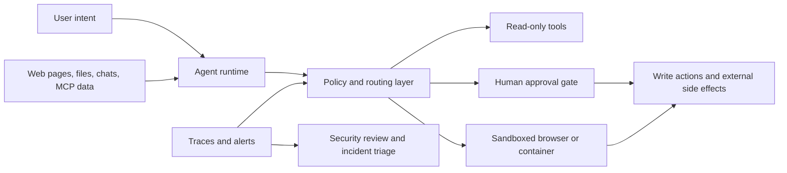

import SupportCTA from "/snippets/support-cta.mdx";

<SupportCTA />

## Summary

Prompt injection turns agent security into a system-design problem. Once an
agent can browse, read files, call connectors, or trigger write actions, the
real question is no longer just "can the model detect bad text?" It becomes
"which untrusted inputs can reach which dangerous actions, under which review
and containment controls?"

## Why It Matters

Prompt injection is not only a prompt-quality issue. It is an architecture
issue that shows up wherever untrusted content and real capability meet.

- Web pages, emails, PDFs, chat logs, connector payloads, and tool outputs can
  all carry hostile instructions.
- The riskiest failures usually involve `sources` plus `sinks`: untrusted input
  reaches a capability that can exfiltrate data, change state, or take action
  for the user.
- Better model behavior helps, but production systems still need boundaries,
  approvals, and logs in case some attacks succeed.

That is why the current security signal around Lockdown Mode is useful for the
handbook: it frames prompt injection as a control-surface problem, not only a
model-intelligence problem.

## Mental Model

Use a four-part review:

1. `sources`: where untrusted content enters the run
2. `sinks`: which tools, connectors, or side effects could become dangerous
3. `boundaries`: what isolation, auth, or scope limits stand between them
4. `confirmations`: which actions require human approval before the system
   proceeds

The key design move is to assume some malicious content will be seen. The goal
is to make sure seeing it does not automatically grant power.

## Architecture Diagram

## Control Stack

### 1. Shrink the capability surface

Least privilege matters more for agents than for chatbots.

- Prefer narrow tool scopes over broad "figure it out" access.
- Treat MCP `roots` and `resources` as explicit permission boundaries, not
  convenience hints.
- Keep sensitive read surfaces and sensitive write surfaces separate when
  possible.
- Avoid giving the same run both broad retrieval power and broad outbound
  action power.

OpenAI's MCP guidance is unusually direct here: trusting an MCP developer is
not enough if the MCP can expose malicious or untrusted user input.

### 2. Contain execution

If the agent can browse or operate a UI, the environment itself becomes part of
the defense.

- Run browser or computer-use flows in isolated environments.
- Treat screenshots, page text, PDFs, chats, and tool outputs as untrusted
  input.
- Keep local environment variables, extensions, and file access scoped down in
  automation harnesses.
- Maintain explicit domain and action allowlists for higher-risk flows.

This is the practical bridge between prompt-injection defense and local-agent
runtime design.

### 3. Put approvals on real sinks

The most important approvals are not generic "continue?" prompts. They sit in
front of actions with durable consequences.

- sending or posting data to third parties
- reading especially sensitive stores after untrusted content was introduced
- destructive writes, permission changes, purchases, or financial actions
- bypassing browser or site safety warnings

Lockdown Mode is relevant because it acts as a deterministic kill switch for
many network-enabled capabilities when the user's risk tolerance is lower than
the feature surface.

### 4. Keep observable traces

Prompt injection defense fails when the only evidence left is "the tool ran."

- Preserve which source introduced the content.
- Log which tool or connector the agent proposed to call next.
- Capture approval decisions and blocked actions.
- Keep enough trace detail for source-to-sink review during incidents.

This creates a useful handoff between security review and
[Evaluation And Observability](/systems/evaluation-and-observability).

## Design Defaults

Useful defaults for production-minded teams:

- Give the agent specific tasks, not vague authority.
- Separate trusted system instructions from retrieved or user-supplied content.
- Prefer read-only tools until a write path is clearly necessary.
- Require confirmation before external writes or sensitive data transfer.
- Use sandboxes, containers, or isolated browsers for computer-use style flows.
- Treat connector and MCP adoption as a governance decision, not a feature
  toggle.

## Current Signal

The seven-day article window only contributed one direct `prompt injection`
headline, so this page should not be read as "the whole repo is now about
prompt injection." The stronger interpretation is narrower:

- OpenAI's current security writing frames prompt injection as social
  engineering against agents, not a solved string-filtering problem.
- Lockdown Mode being available across logged-in users shows that product teams
  now expose deterministic capability restrictions as a first-class control.
- The MCP guidance and security best practices documents make trust boundaries,
  scope limits, and session-level risks concrete for builders.

That combination is strong enough to justify a durable systems page rather than
another short-lived radar note.

## Citations

- Official source: [Designing AI agents to resist prompt injection](https://openai.com/index/designing-agents-to-resist-prompt-injection/)
- Official source: [Understanding prompt injections](https://openai.com/safety/prompt-injections/)
- Official source: [ChatGPT release notes: Lockdown Mode availability](https://help.openai.com/en/articles/6825453-chatgpt-release-notes)
- Official source: [OpenAI MCP and connectors guidance](https://developers.openai.com/api/docs/guides/tools-connectors-mcp)
- Official source: [OpenAI MCP builder guide](https://developers.openai.com/api/docs/mcp)
- Official source: [OpenAI computer use guide](https://developers.openai.com/api/docs/guides/tools-computer-use)
- Official source: [MCP security best practices](https://modelcontextprotocol.io/docs/tutorials/security/security_best_practices)
- Reference repo: [openai/codex](https://github.com/openai/codex)
- Reference repo: [modelcontextprotocol/modelcontextprotocol](https://github.com/modelcontextprotocol/modelcontextprotocol)
- Reference repo: [promptfoo/promptfoo](https://github.com/promptfoo/promptfoo)

## Reading Extensions

- [Protocols And Interoperability](/systems/protocols-and-interoperability)
- [Context Engineering](/systems/context-engineering)
- [Evaluation And Observability](/systems/evaluation-and-observability)
- [Local Agent Tooling Source Map](/contributor-kit/reference-notes/local-agent-tooling-source-map)
- [Claude Code Workshop](/workshops/desktop-agents/claude-code)
- [Systems Overview](/systems)

## Update Log

- 2026-06-07: Added a dedicated systems page that frames prompt injection as a
  source-to-sink containment problem across MCP, browser, and local-agent
  surfaces.
