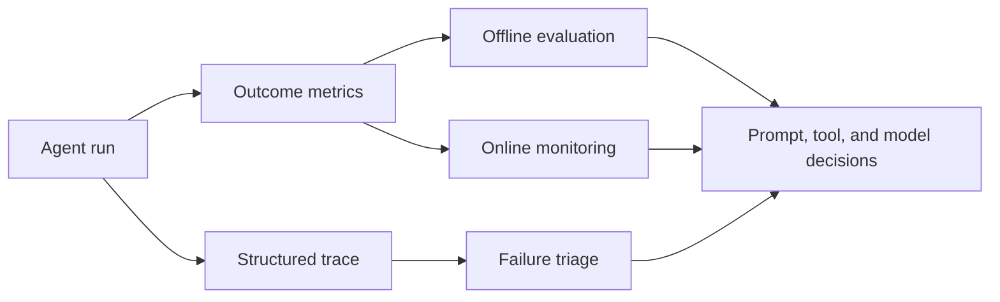

import SupportCTA from "/snippets/support-cta.mdx";

<SupportCTA />

## Summary

Evaluation tells you whether the agent is good enough for a task. Observability
tells you why it passed or failed. Production systems need both, because scores
without traces are hard to improve and traces without metrics are hard to
prioritize.

This page covers general evaluation and observability for agent systems, with a
dedicated section on why LLM-based agents need a different evaluation mindset
than traditional software.

## Why It Matters

Agent systems are probabilistic and multi-step. That makes them harder to judge
than deterministic software.

- A correct answer may depend on search, tools, or file state.
- The same task can fail for very different reasons.
- A prompt or model change can improve one capability while silently harming
  another.

Teams therefore need two loops:

- an `evaluation loop` for measuring capability
- a `diagnostic loop` for explaining behavior

## Why LLM Evaluation Is Different

Evaluating an agent system is not the same as testing a function. Four
properties of LLM-based systems break traditional test assumptions.

**Nondeterministic outputs.** The same prompt can produce different valid
answers across runs. Tests that assert an exact string match will flake. You
need tolerance for semantic equivalence, not just syntactic identity. See
[LLM Foundations for Agent Systems](/foundations/llm-foundations-for-agent-systems)
for the underlying model behavior.

**Probabilistic success.** An agent may succeed on 8 out of 10 runs and fail
twice for reasons that are not reproducible. Evaluation shifts from "does it
pass?" to "what fraction of runs succeed, and under what conditions?" This
means reporting confidence intervals, not just point scores.

**Tool-call variance.** Two correct trajectories may call tools in different
orders, use different argument combinations, or skip steps that another path
includes. Structured correctness checks must compare intent and outcome, not
just the literal call sequence. See
[Context Engineering](/systems/context-engineering) for how tool selection
relates to prompt and retrieval design.

**Ambiguous criteria.** For open-ended tasks (summarization, drafting,
creative synthesis), there is often no single correct answer. Multiple
responses can be equally valid. This makes binary pass/fail insufficient and
pushes you toward rubric-based scoring, pairwise comparison, or human
judgment.

## Evaluation Approach Map

No single evaluation method covers every task. Match the approach to what you
are measuring.

| Approach | When to use | What it checks |
|---|---|---|
| Exact / structured checks | Tool calling, JSON schemas, output format | Correct function selected, correct parameter types, valid schema |
| Reference-based comparison | Retrieval-augmented tasks, factual QA | Output matches a known-good reference (exact, fuzzy, or semantic similarity) |
| Rubric scoring | Open-ended generation, summarization, reasoning | Human or judge model scores output against a multi-point rubric |
| Pairwise comparison | Model or prompt selection | Given two outputs, a human or judge picks the better one |
| LLM-as-a-judge | High-volume automated scoring where human review is too slow | A second LLM evaluates output quality using a structured prompt |
| Human review | High-stakes, novel tasks, calibration of automated methods | Domain expert rates output quality; used to validate and calibrate judges |
| Online telemetry | Production monitoring | Success rate, latency, escalation rate, retries, user feedback signals |

Most production systems combine two or more. A common pattern: structured
checks for tool correctness, LLM-as-a-judge for answer quality, human review
for calibration, and online telemetry for regression detection.

## Human-in-the-Loop vs LLM-as-a-Judge

Both approaches have a role. Knowing where each is strongest avoids the two
common failures: relying on humans too slowly to catch regressions, or relying
on a judge model that is not calibrated to your domain.

**Human-in-the-loop is strongest when:**

- the task is high-stakes (medical, legal, financial advice)
- criteria are novel or poorly defined and you are still learning what "good"
  looks like
- you need to calibrate or audit an automated judge
- edge cases are rare but critical (safety, bias, harmful output)

**LLM-as-a-judge is strongest when:**

- you need to score hundreds or thousands of runs per change
- criteria are well-defined and stable enough to encode in a prompt
- you are running regression tests on every commit or deployment
- the judge model can be validated against a held-out human-labeled set

**Calibration is not optional.** A judge model that agrees with humans 60% of
the time is a noisy signal, not a replacement. Build a calibration set of
100-200 human-labeled examples. Measure agreement rate. Retrain or adjust the
judge prompt when agreement drops below your threshold.

**Audit expectations.** Regulators and internal reviewers will ask "who checked
this?" Keep records of:

- which runs were human-reviewed vs judge-scored
- judge agreement rates on calibration samples
- any overrides where a human disagreed with the judge

See [Deep Research Agents](/case-studies/deep-research-agents) for a worked
example of mixing automated scoring with human calibration.

## Mental Model

Think in three layers.

- `offline evaluation`: benchmark-style checks run on known tasks to compare
  prompts, models, tools, and policies.
- `online evaluation`: production signals such as success rate, latency,
  escalation rate, retries, or human overrides.
- `observability`: traces, tool logs, state transitions, and artifacts that
  show what the system actually did.

Different task types need different metrics.

- Tool use often needs structured correctness checks such as function and
  parameter matching.
- General assistant tasks often need answer-level correctness plus task-level
  completion.
- Data generation or synthesis tasks may need comparative review, judge models,
  or human verification.

The current signal adds one more useful split inside offline evaluation:

- `spec-driven evals`: turn written product requirements or policies into
  inspectable behavior taxonomies, stratified test cases, and verdicts tied to
  the original rule or expectation.
- `benchmark authoring`: create portable task suites and leaderboards that can
  be edited, run, and compared from a local development workflow.

## Architecture Diagram

## Framework Landscape

A compact comparison of common evaluation and observability frameworks. This is
not exhaustive; it covers the three most frequently referenced in agent-system
work.

| Framework | Primary focus | Key strengths | Source |
|---|---|---|---|
| **Langfuse** | Observability and eval platform | Open-source, trace-first design, supports LLM-as-a-judge scoring, prompt versioning, dataset management | [langfuse.com](https://langfuse.com) |
| **LangSmith** | Observability and eval for LangChain ecosystem | Tight LangChain/LangGraph integration, trace visualization, automated evaluation workflows, dataset curation | [smith.langchain.com](https://smith.langchain.com) |
| **Ragas** | RAG-specific evaluation metrics | Metrics for faithfulness, answer relevance, context precision, and context recall; framework-agnostic | [docs.ragas.io](https://docs.ragas.io) |

All three support the evaluation approaches described in the approach map
above. Choose based on your stack integration needs and whether your primary
focus is RAG-specific metrics (Ragas), open-source self-hosting (Langfuse), or
LangChain ecosystem alignment (LangSmith).

## Tool Landscape

The imported reference material highlights three useful evaluation shapes:

- benchmark-style tool-use evaluation, where structured matching checks whether
  the agent selected the right function and arguments
- general-assistant evaluation, where tasks require multi-step reasoning and
  broader success judgments
- generation-quality evaluation, where relative comparison or human review is
  often more useful than one exact metric

Observability should remain structured from the start.

- Keep full tool inputs and outputs.
- Preserve failure records rather than collapsing them into generic errors.
- Track step order, retries, and state changes.
- Keep traces readable by both humans and machines.

That is what turns a black-box failure into an actionable bug.

### Current evaluation signal

The June 2026 source cluster makes the evaluation loop more concrete than a
generic "run some benchmarks" story:

- `ASSERT` shows a requirement-driven path from written intent to executable
  evals. The useful lesson is not the product name. It is the pipeline shape:
  specification, editable taxonomy, generated scenarios, full traces, and
  inspectable scoring.
- `Kaggle Benchmarks` shows a benchmark-authoring path that now fits local
  development and coding-agent workflows instead of only a hosted notebook
  flow. That makes benchmark work easier to version, review, and iterate next
  to real application code.
- `open eval registries and trace grading` remain useful when teams need shared
  baselines, but they should sit beside product-specific evaluation rather than
  replace it.

This suggests a practical operating model:

1. Write the intended behavior in a form humans can review.
2. Turn that specification into executable cases or benchmark tasks.
3. Run the target agent with full traces, tool evidence, and environment
   context preserved.
4. Review both the score and the failure artifacts before changing prompts,
   tools, or runtime policy.

### Runtime traces versus control planes

Evaluation also needs one boundary that teams often blur:

- `runtime instrumentation` explains what happened in one run.
- `eval infrastructure` compares many runs against explicit expectations.
- `control planes` govern fleets of agents, environments, and policies across
  an organization.

Do not collapse those into one category. A strong trace is not a full control
plane. A control plane is not a substitute for product-specific evals. See
[Enterprise Agent Control Planes](/contributor-kit/reference-notes/enterprise-agent-control-planes)
for that organization-level layer.

## Tradeoffs

- Offline benchmarks are useful, but they can overfit the system to lab tasks
  that are cleaner than production reality.
- Online metrics reflect real usage, but they lag and are noisy without good
  segmentation.
- Judge-model evaluation scales well, but it still needs human calibration.
- Rich traces improve diagnosis, but they create storage, privacy, and review
  overhead.
- Pairwise comparison is easy for humans but does not give you an absolute
  score; use it for ranking, not for release gating.
- LLM-as-a-judge is fast but inherits the judge model's biases; a judge that
  prefers verbose outputs will systematically over-score wordy generations.

Useful operating defaults:

- evaluate the capability you are actually changing
- treat written policy or product requirements as evaluation inputs, not only
  background prose
- keep benchmark tasks and scoring artifacts close enough to code that they can
  be versioned and reviewed
- keep traces for both failed and successful runs
- review failure modes before rewriting prompts
- do not ship "tool failed" as the only explanation developers can see
- maintain a calibration set and re-check judge agreement after every model
  change

## Citations

- Official source: [Turn specs into evals for any agent with ASSERT](https://commandline.microsoft.com/assert-written-intent-executable-evals/)
- Official source: [Build Kaggle Benchmarks Locally](https://blog.google/innovation-and-ai/technology/developers-tools/build-kaggle--benchmarks-locally/)
- Official source: [Build agents you can trust across any framework with open evals and a control standard](https://devblogs.microsoft.com/foundry/build-2026-open-trust-stack-ai-agents/)
- High-signal repository: [responsibleai/ASSERT](https://github.com/responsibleai/ASSERT)
- High-signal repository: [openai/evals](https://github.com/openai/evals)

## Reading Extensions

- [Enterprise Agent Control Planes](/contributor-kit/reference-notes/enterprise-agent-control-planes)
- [LLM Foundations for Agent Systems](/foundations/llm-foundations-for-agent-systems)
- [Context Engineering](/systems/context-engineering)
- [Customer Support Agents](/case-studies/customer-support-agents)
- [Deep Research Agents](/case-studies/deep-research-agents)
- [Protocols And Interoperability](/systems/protocols-and-interoperability)
- [Systems Overview](/systems)

## Update Log

- 2026-06-06: Added spec-driven evals, local benchmark authoring, and
  control-plane boundary notes using current ASSERT and Kaggle source signals.
- 2026-05-18: Major revision adding LLM-specific evaluation methodology, approach map, human-in-the-loop vs LLM-as-a-judge, and framework landscape.
- 2026-04-21: Initial repo-native draft based on imported reference material and lab rewrite rules.
