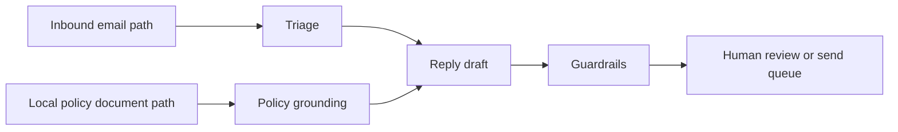

import SupportCTA from "/snippets/support-cta-zh-Hans.mdx";

<SupportCTA />

## 概述

客户支持智能体帮助将进入的客户消息转化为已分类的
工单、基于证据的答案、回复草稿以及人工交接。最安全的版本
不是一个自治的“回复所有内容”的机器人。

从一个本地、基于政策的工作流开始：读取一条客户输入，查阅
获批的支持材料，起草回复，并把最终发送决定
留给人工。

## 这为什么重要

支持工作足够重复，适合引入智能体；但又足够敏感，需要严格边界。

之所以有用，是因为许多消息具有相似模式：

- 产品问题
- 账单问题
- 投诉
- 退款或更换请求
- 账户和隐私请求

之所以有风险，是因为一条糟糕的回复可能承诺错误的补救措施、泄露私人
信息、错误处理愤怒客户，或忽略升级规则。

## 心智模型

一个可长期运行的客户支持智能体包含五个步骤：

- `ingest`: 从电子邮件、表单、聊天导出或 CRM
  记录中读取进入的消息
- `classify`: 识别工单类型、紧急程度、情绪和请求结果
- `ground`: 检索相关的本地政策、FAQ、退款规则或升级
  说明
- `draft`: 生成一条面向客户的回复，只引用获批的支持
  材料
- `gate`: 判断这条回复是否可以安全发送，或是否需要人工审查

本地文档路径很重要。它让政策来源变得明确：

```text
EMAIL_PATH=/Users/example/inbox/customer-complaint.txt
POLICY_PATH=/Users/example/support/refund-and-escalation-policy.md
```

这比让模型凭通用记忆“像支持团队一样回答”要清晰得多。

对于这个案例研究来说，边界就是主要教训：

- 电子邮件路径是客户输入
- 政策路径是获批的事实来源
- 草稿是供审查的产物
- 最终决定由人工负责

## 架构图



## 工具生态

支持智能体通常会组合一小组能力：

- 读取本地文件，用于获批的政策和 FAQ 文档
- 邮箱或 CRM 连接器，用于进入的客户消息
- 分类逻辑，用于路由和升级
- 在支持材料上进行检索或搜索
- 带有语气和政策约束的草稿生成
- 审计输出，显示哪些政策证据影响了回复

对于一个入门工作流，本地路径就足够了。智能体可以读取一条进入的
消息文件和一份政策文档文件。生产系统之后可以把这些本地路径替换为
Gmail、帮助台、CRM 或基于 MCP 的资源，但
同样的边界应该继续保持可见。

MCP 风格的 roots 和 resources 在这里很有用，因为它们迫使系统
明确说明智能体可以访问什么。政策文件夹 root 与完整磁盘
访问不同。一个选定的政策 resource 与爬取每条客户
记录不同。

## 保护措施

优秀的支持智能体不应自动发送回复，除非运行
规则极其狭窄。

有用的默认做法：

- 除非本地政策明确允许，否则绝不承诺退款、积分、更换、法律结果或账户
  变更
- 对拒付、安全问题、辱骂消息、隐私
  请求和监管问题始终升级处理
- 包含用于起草回复的政策证据
- 保持回复平静、简短，并面向客户
- 将“政策证据不足”视为需要人工审查的有效理由

## 权衡

- 本地政策锚定提高了控制力，但政策文档必须保持
  最新。
- 仅起草、不自动发送的窄工作流更安全，但仍然需要审查容量。
- 丰富的邮箱集成减少了复制粘贴工作，但会扩大隐私
  和权限风险。
- 自动回复提高了速度，但如果分类或
  政策锚定较弱，就可能损害信任。

实用默认方案：

- 从基于显式本地文档路径的仅草稿回复开始
- 只有在基于政策的草稿循环可靠之后，再添加邮箱集成
- 仅对低风险、高置信度且审计日志清晰的案例启用自动发送

## 入门项目

这条案例研究路径现在有两个入门项目：

- [Customer Support Email Agent Starter](/zh-Hans/case-studies/examples/customer-support-email-agent-starter)：
  一个更小的仅草稿工作流，用于从本地路径加载客户邮件、加载本地政策、
  分类投诉、查询、退款请求和交接案例，并起草安全的基于政策回复。
- [Customer Email Assist Starter](/zh-Hans/case-studies/examples/customer-email-assist-starter)：
  一个接入邮箱的后续入门项目，用于 Gmail 同步、本地 SQLite 问题队列、
  客户审核、确定性的发送队列执行，以及一个用于编辑和批准回复的
  dashboard。

## 引用

- 官方来源：[OpenAI computer environment for agents](https://openai.com/index/equip-responses-api-computer-environment/)
- 官方来源：[OpenAI Responses API tools and file search](https://openai.com/index/new-tools-and-features-in-the-responses-api/)
- 官方来源：[Claude Code MCP documentation](https://code.claude.com/docs/en/mcp)
- 官方来源：[MCP roots](https://modelcontextprotocol.io/specification/2025-06-18/client/roots)
- 官方来源：[MCP resources](https://modelcontextprotocol.io/specification/2025-06-18/server/resources)

## 延伸阅读

- [Protocols And Interoperability](/zh-Hans/systems/protocols-and-interoperability)
- [Agent Memory And Retrieval](/zh-Hans/patterns/agent-memory-and-retrieval)
- [Case Studies Overview](/zh-Hans/case-studies)

## 更新日志

- 2026-04-24：为可读性优化了该案例研究，并使本地输入、
  政策来源、审查产物和人工决策边界更加明确。
- 2026-04-23：新增了一个本地优先的客户支持案例研究，包含一个
  基于政策的电子邮件回复入门项目。
