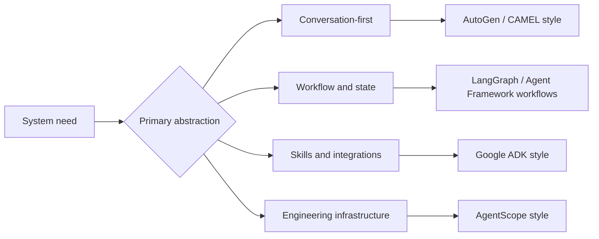

import SupportCTA from "/snippets/support-cta-zh-Hans.mdx";

<SupportCTA />

## 摘要

智能体框架将状态、工具、消息传递和控制流等重复出现的运行时问题打包处理。到了 2026 年，最有价值的比较问题已经不再只是“chat loop 还是 graph？”而是“哪种抽象拥有这项工作：对话、显式工作流、工程基础设施，还是按需加载的 skills 和 integrations？”

## 为什么这很重要

团队通常会在第一个手工原型开始拖后腿时转向框架。常见的痛点包括：

- 重复的智能体循环代码
- 不清晰的状态处理
- 脆弱的工具接线
- 可观测性不足
- 难以调试的多智能体协调

框架市场如今正在同时走向收敛与分化。Microsoft 正在把 AutoGen 和 Semantic Kernel 的思路整合进 Agent Framework。Google ADK 正在推动一种以 skill 和 integration 为先的模型。较早的框架仍然重要，但比较维度已经比最初的“对话 vs 图”划分更宽。

## 心智模型

六个锚点有助于理解当前格局：

- `AutoGen`：以对话为先的协作
- `CAMEL`：轻量级、由角色驱动的协作
- `LangGraph`：图结构控制流与可恢复状态
- `Microsoft Agent Framework`：统一的智能体加显式工作流
- `Google ADK`：代码优先的智能体，按需加载 skills 和 integrations
- `AgentScope`：工程优先的多智能体基础设施

它们并不是直接替代关系，而是代表了不同的控制中心：

- 以对话为先的框架，将协作优化为一种对话形式
- 以图为先的框架，优化显式状态转换和编排
- 以 skill 为先的框架，优化可复用的专业能力和工具生态
- 以工程为先的框架，优化运行时纪律和生产环境需求

## 架构图

## 工具生态

### 全球覆盖

- 当系统应表现得像一个由多个专业人士组成、通过消息交换协作的团队时，AutoGen 依然很有用。
- 当角色配对和自治协作比重型编排更重要时，CAMEL 依然很有用。
- 当循环、检查点和可恢复状态转换需要显式化时，LangGraph 依然很有用。
- Microsoft Agent Framework 之所以重要，是因为它将智能体抽象与企业级特性结合起来，例如状态管理、中间件、遥测和基于图的工作流。它是当前最清晰的信号，表明 AutoGen 和 Semantic Kernel 这两条线正在被拉向一个共享的后继者。
- 当智能体应通过 skills 加载专业能力，并快速连接外部工具、合作伙伴平台和云服务时，Google ADK 很重要。

### 中国相关覆盖

- AgentScope 仍然是当前中国相关集合中最清晰的工程优先参考，其更强调大规模协调、运行时基础设施和生产运维。

### 选择标准

- 当协作行为是主要抽象时，选择以对话为先的框架。
- 当显式控制流、检查点或混合的智能体-函数编排最重要时，选择以图为先的框架。
- 当可复用的领域指令和外部集成是设计核心时，选择以 skill 为先的框架。
- 当运营纪律来得很早，且团队预计多智能体系统应像软件基础设施一样运作，而不只是提示词时，选择以工程为先的框架。
- 如果任务足够确定性，适合用工作流或普通函数完成，就不要强行把它塞进自治智能体抽象里。

## 权衡

- 以对话为中心的框架在协作上很自然，但可能更难约束和调试。
- 以图为中心的框架在运维层面更容易推理，但前期需要更多显式设计。
- 以 skill 为先的框架减少了单体提示词并加快复用，但也引入了另一层打包和评估边界。
- 重工程化的框架在生产需求来得很早时很有帮助，但对小型原型来说可能过于庞大。

有用的默认原则：

- 从控制模型出发，而不是从品牌熟悉度出发
- 对确定性任务优先使用工作流或普通函数
- 让框架选择与产品表面和团队能力保持一致
- 把 integrations 和 skills 视为一等架构，而不是事后补充

## 引用

- 当前官方框架阅读材料列在 `external_readings` 中。

## 延伸阅读

- [框架对比](/zh-Hans/ecosystem/framework-comparison)：面向初学者的指南，帮助在
  LangChain、LlamaIndex 和无框架方案之间做选择。
- [Reasoning And Control Patterns](/zh-Hans/patterns/reasoning-and-control-patterns)
- [Planning And Reflection](/zh-Hans/patterns/planning-and-reflection)
- [Ecosystem Overview](/zh-Hans/ecosystem)

## 更新日志

- 2026-04-23：使用当前 Microsoft Agent Framework 和 Google ADK 信号刷新页面。
- 2026-04-21：基于导入的参考材料和实验室重写规则形成的仓库原生初稿。
