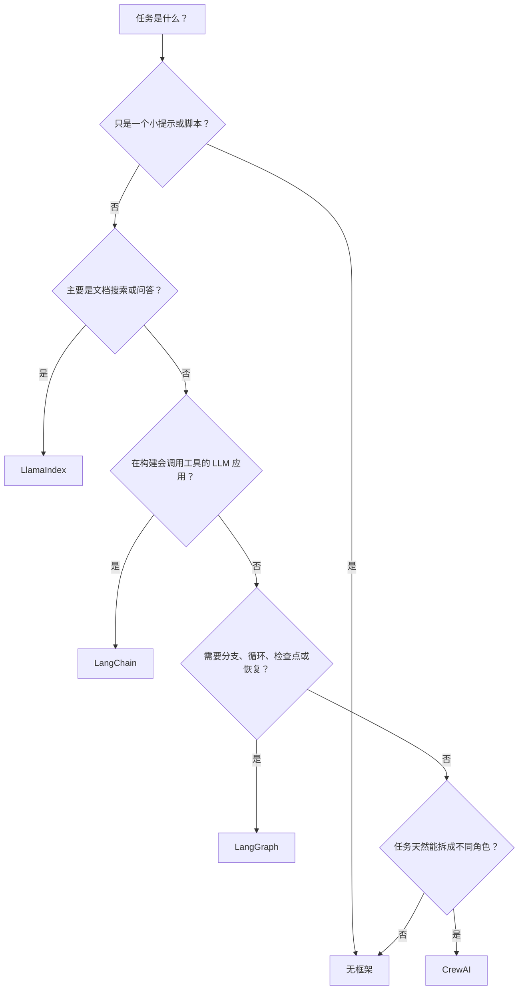

import SupportCTA from "/snippets/support-cta-zh-Hans.mdx";

<SupportCTA />

## 摘要

AI 框架把 LLM 应用里反复出现的工程工作封装起来：提示词、工具调用、检索、状态、
路由、重试和可观测性。它们存在的原因很简单：第一个 demo 往往不难，但第二、第三个
功能很快会暴露出重复的工程问题。

给初学者的实用默认原则是：**先用能解决问题的最小方案；当项目需要的结构已经难以
手动维护时，再引入框架。**

## 为什么这很重要

如果任务只是单次提示、一个小脚本，或者你能清楚看见每一步的原型，直接调用 API
通常已经足够。当项目开始需要下面这些能力时，框架才更有意义：

- **记忆**：跨多轮对话或跨会话保留上下文
- **检索**：从文档、数据库或私有知识库中找信息
- **工具调用**：搜索、数据库查询、日历操作、代码执行等
- **有状态控制流**：分支、循环、重试、检查点
- **协作模式**：多个角色或 agent 分工完成任务
- **可观测性**：能追踪失败原因，并持续改进

常见的过度工程化模式，是项目还不需要框架时就先引入框架。这样会把一个小型学习项目
变成依赖管理、概念学习和调试负担。真正该问的问题不是“哪个框架最好？”，而是：

> 我当前项目里的哪一部分正在变得重复、脆弱，或者难以推理？

## 心智模型

可以把框架选择理解为：手写脚本、应用脚手架、工作流引擎之间的选择。

| 选项 | 生活类比 | 含义 |
| --- | --- | --- |
| **无框架** | 手写一张检查清单 | 直接调用 LLM API，自己处理提示词、状态、工具调用和错误处理。适合流程很小、每一步都看得清楚的任务。 |
| **LlamaIndex** | 图书馆目录和咨询台 | 帮你摄入、索引、搜索文档，并围绕文档回答问题。适合核心任务是把 LLM 连接到私有数据。 |
| **LangChain** | LLM 应用脚手架 | 提供模型、提示词、工具、agent、流式输出和集成等可复用部件。适合构建更完整的 LLM 应用。 |
| **LangGraph** | 工作流引擎或状态机 | 把步骤、分支、循环、检查点和恢复机制显式表达出来。适合控制流比快速搭建更重要的场景。 |
| **CrewAI** | 有明确分工的小项目组 | 把 agent 建模为带角色和任务的协作者。适合 planner、researcher、writer、reviewer 这类分工自然存在的任务。 |

## 对比表格

| 维度 | 无框架 | LlamaIndex | LangChain | LangGraph | CrewAI |
| --- | --- | --- | --- | --- | --- |
| **用途** | 直接调用 LLM，手动控制 | 数据摄入、索引、检索和文档问答 | 通用 LLM 应用与 agent 开发 | 有状态的图编排 | 基于角色的多 agent 任务执行 |
| **复杂度** | 低 | 低到中 | 中 | 中到高 | 中 |
| **最适合** | 学习、demo、一次性脚本、简单助手 | RAG、知识库、文档搜索、内部问答 | 带工具的聊天机器人、agent 应用、可复用集成 | 长流程、循环、检查点、人工审核、故障恢复 | 研究、写作、分析、运营等能按角色分工的任务 |
| **帮你少写什么** | 不提供框架层；各个部分需要直接实现 | loader、索引、retriever、查询流程 | 模型/工具/提示词连接、agent harness、集成 | 状态转移、分支、持久化、可恢复执行 | 角色/任务设置和委派模式 |
| **何时避免** | 状态、检索或工具已经明显增长时 | 文档不是核心问题时 | 直接 API 调用已经够用时 | 流程短且线性时 | 单个 agent 或普通工作流已经够用时 |

## 场景演练

### 场景 1：简单聊天机器人

- **无框架**：保存消息列表，调用模型，返回答案。对原型来说通常够用。
- **LangChain**：当聊天机器人需要工具调用、结构化输出、流式输出、追踪，或可复用的
  模型/提示词连接时，才开始有价值。
- **结论**：先不用框架。当聊天机器人从单个 chat loop 变成完整应用时，再考虑
  LangChain。

### 场景 2：基于内部 PDF 的文档问答

- **无框架**：你要自己解析文件、切分文本、生成 embedding、存向量、检索相关片段、
  拼上下文，并处理引用。
- **LlamaIndex**：提供更聚焦的路径，用来加载文档、建立索引，并围绕私有数据查询。
- **LangChain**：也可以构建检索流程，尤其适合“检索只是更大 agent 应用中的一个工具”
  的情况。
- **结论**：如果文档检索就是核心产品，优先考虑 LlamaIndex；如果检索只是更大
  agent 应用的一部分，再考虑 LangChain。

### 场景 3：多步骤研究工作流

- **LangGraph**：把流程显式建模为 plan、search、synthesize、review、revise
  等节点。当流程需要暂停、恢复或故障处理时，检查点尤其有用。
- **CrewAI**：把流程建模为 planner、researcher、writer、editor 等角色，每个
  角色负责不同任务。
- **结论**：想快速做角色分工原型，可以选 CrewAI；执行控制和状态才是主要风险时，
  选 LangGraph。

## 有用的默认原则

- 除非检索、工具或状态已经占据主要复杂度，否则第一版先不用框架。
- 问题是“如何让这些数据能被 LLM 搜索和回答”时，选 **LlamaIndex**。
- 问题是“如何构建一个连接模型、提示词、工具和集成的 LLM 应用”时，选
  **LangChain**。
- 问题是“如何控制并恢复一个多步骤流程”时，选 **LangGraph**。
- 问题是“如何把任务分配给多个命名角色”时，选 **CrewAI**。
- 如果任务足够确定性，用普通函数或工作流。只有当 agent 能提供有用的协调、工具调用
  或决策能力时，再引入 agent。

## 引用

- [LangChain 文档](https://docs.langchain.com/oss/python/langchain/overview)
- [LlamaIndex 文档](https://developers.llamaindex.ai/python/framework/)
- [LangGraph 文档](https://docs.langchain.com/oss/python/langgraph/overview)
- [CrewAI 文档](https://docs.crewai.com/)
- 当前官方阅读材料列在 `external_readings` 中。

## 延伸阅读

- [智能体框架](/zh-Hans/ecosystem/agent-frameworks)：中级水平的框架对比，涵盖
  以对话为先、以图为先、以 skill 为先和以工程为先的框架。
- [智能体运行时构建模块](/zh-Hans/patterns/agent-runtime-building-blocks)：
  框架封装的运行时基元。
- [生态概览](/zh-Hans/ecosystem)：完整的生态板块。

## 更新日志

- 2026-06-02：重写为面向初学者的决策指南，更新官方链接，改进心智模型，并减少
  依赖具体 API 的表述。
- 2026-05-04：面向初学者的框架对比初稿。
