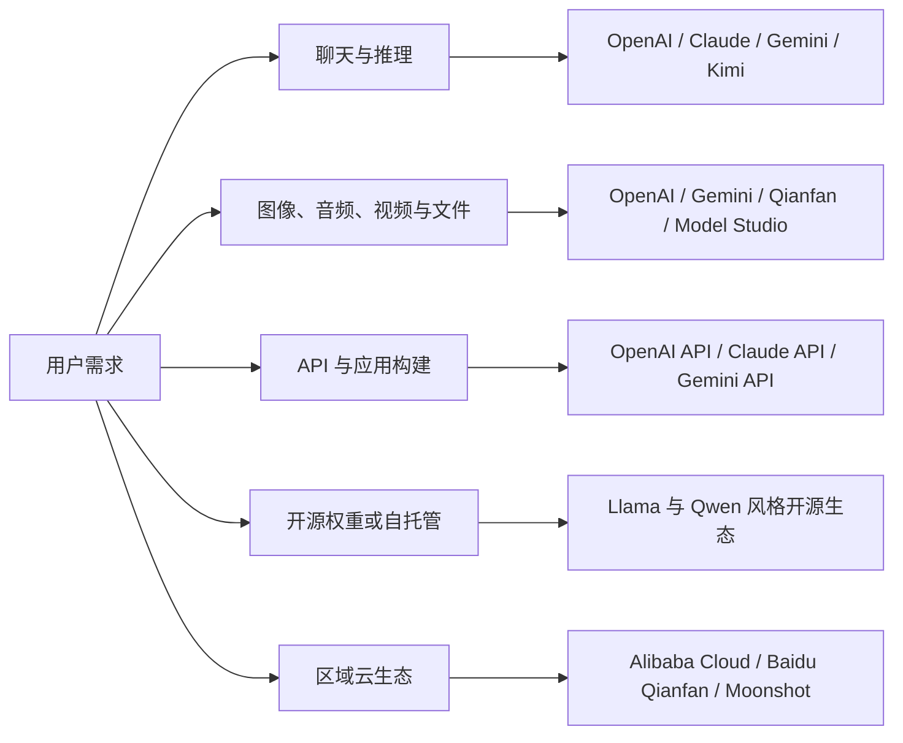

import SupportCTA from "/snippets/support-cta-zh-Hans.mdx";

<SupportCTA />

## 摘要

理解模型生态时，最好先按学习者可以完成的事情来分组：聊天与推理、多模态输入、生成能力、开源权重部署，以及区域云平台接入。这个页面是一个入门地图，不是模型排行榜。

## 为什么重要

学生和早期构建者常常先听到模型名称，却还不了解它背后的产品形态。一个有用的地图应该回答四个问题：

- 这个模型家族适合什么类型的任务？
- 我该通过什么方式访问它：消费级应用、API、开源权重，还是云平台？
- 它更适合学习、原型验证，还是部署？
- 真正用于项目之前需要检查什么？

## 架构图

## 供应商地图

| 供应商家族 | 学生应记住什么 | 常见访问方式 | 适合的第一个用途 |
| --- | --- | --- | --- |
| OpenAI | 覆盖文本、推理、图像、音频、视频、实时交互和智能体开发的综合模型平台。 | ChatGPT 面向应用使用；OpenAI API 面向构建者。 | 通用助手、编码辅助、多模态原型和智能体工作流。 |
| Anthropic Claude | 强调文档、推理、编码和工作空间协作的助手家族，同时提供应用和 API。 | Claude 应用与 Claude API。 | 长文档审阅、谨慎写作、编码辅助和 artifact 风格产出。 |
| Google Gemini | Google 的模型家族，和 Google AI Studio、Gemini API、Google Cloud 路径结合紧密。 | Gemini 应用、Google AI Studio、Gemini API 和云部署路径。 | 多模态实验、带搜索 grounding 的原型，以及 Google 技术栈应用。 |
| Meta Llama | 开源权重模型生态，可通过 Meta 与合作伙伴渠道获取。 | 下载、合作伙伴托管，或云服务商 API。 | 学习开源权重取舍、本地实验和重视可迁移性的构建。 |
| Alibaba Cloud Qwen / Model Studio | 中国相关模型平台，覆盖 Qwen、多模态、编码模型和 OpenAI 兼容 API 模式。 | 阿里云百炼 Model Studio 与 DashScope 风格 API。 | 面向中国场景的应用原型、Qwen 实验和云端模型接入。 |
| Baidu Qianfan / ERNIE | 中国云模型平台，覆盖 ERNIE、DeepSeek、Qwen 相关选项、多模态生成、搜索和应用构建。 | 百度千帆 ModelBuilder 与 AppBuilder。 | 中文产品实验、企业应用构建和多模态探索。 |
| Moonshot Kimi | Kimi API 家族，包含长上下文文本和视觉相关模型选项。 | Kimi 应用与 Moonshot API。 | 中文长上下文、文档审阅和早期 API 实验。 |

## 能力地图

| 能力 | 含义 | 可以优先查看的模型家族 |
| --- | --- | --- |
| 聊天与推理 | 回答问题、起草文本、解释概念、规划和解决多步骤任务。 | OpenAI、Claude、Gemini、Kimi、Qianfan、Model Studio。 |
| 视觉与文件理解 | 阅读图像、截图、图表、PDF 和其他上传材料。 | OpenAI、Claude、Gemini、Qianfan、Model Studio、Kimi vision 选项。 |
| 图像、音频和视频生成 | 不只是阅读内容，也能创建或转换媒体。 | OpenAI 专门模型、Gemini 生态工具、Qianfan、Model Studio。 |
| 工具使用与智能体工作流 | 调用函数、使用工具，或连接外部系统。 | OpenAI API、Claude API、Gemini API、Model Studio、Qianfan。 |
| 开源权重部署 | 让团队研究、托管、调优，或在单一托管应用之外运行模型。 | Llama、Qwen 开源版本，以及合作伙伴托管的开源模型目录。 |
| 区域平台接入 | 帮助团队匹配语言、合规、数据区域、计费和本地生态需求。 | Alibaba Cloud Model Studio、Baidu Qianfan、Moonshot Kimi、云合作伙伴。 |

## 如何选择起点

选择能够教会正确问题的最简单界面。

- 第一次接触时，从 ChatGPT、Claude、Gemini 或 Kimi 这类消费级助手开始，重点练习任务设计。
- 学 API 时，先选一个模型供应商，做一个小的请求-响应应用，再比较不同供应商。
- 学多模态时，一次只测试一种输入类型：图像、文档、音频或视频。
- 学开源权重时，先明确为什么需要可迁移、本地控制或许可证灵活性，再选择模型。
- 做中国相关部署时，从一开始就检查 Qianfan、Model Studio 和 Kimi，而不是最后才把它们当替代项。

## 常见错误

- 把最新模型名称直接等同于所有任务上的最好选择。
- 把应用功能和 API 功能当成同一个产品来比较。
- 等原型完成后才检查价格、速率限制、区域可用性、安全政策和数据控制。
- 因为想要可迁移性而选择开源权重，却没有预算托管、评估、监控和更新成本。
- 只因为语言覆盖选择区域平台，却没有检查部署、计费和支持要求。

## 课堂练习建议

选择一个任务，例如“总结课程阅读材料并生成复习测验”。让学生比较三种访问模式：

- 消费级助手
- 托管 API
- 开源权重或区域云选项

输出应该是一张短表：任务质量、设置难度、成本或使用限制，以及生产团队下一步需要验证什么。

## 引用

- 当前官方模型与平台阅读材料列在 `external_readings` 中。

## 延伸阅读

- [智能体平台与低代码构建器](/zh-Hans/ecosystem/agent-platforms-and-low-code-builders)
- [智能体系统的 LLM 基础](/zh-Hans/foundations/llm-foundations-for-agent-systems)
- [评估与可观测性](/zh-Hans/systems/evaluation-and-observability)

## 更新日志

- 2026-05-19：根据 issue #27 添加入门模型生态地图。
