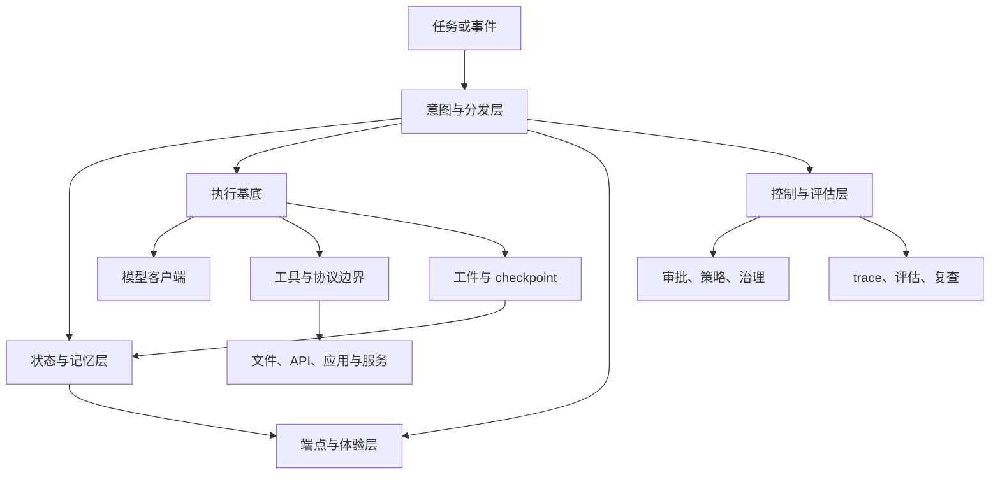

import SupportCTA from "/snippets/support-cta-zh-Hans.mdx";

<SupportCTA />

## 概述

智能体运行时仍然由一组反复出现的组件构成，但实际边界已经
扩大。现代运行时不再只是一个调用模型的循环。它通常还包含
受控工作空间、显式的工具与协议边界、持久状态、策略与评估
挂钩，以及智能体出现的一个或多个用户表面。

这很重要，因为当前的产品信号已经不再是“聊天框里的智能体”，
而是能跨文件、工具、应用，甚至 agent-first 设备工作的智能体。

## 为什么重要

大多数智能体系统仍然会收敛到同一批核心运行时问题：

- 消息如何表示
- 状态存放在哪里
- 工具如何注册和调用
- 循环如何停止或重试
- 错误如何暴露

但当前的发布信号又加了一层问题：

- 执行究竟在哪里发生
- 运行时如何跨智能体和端点被治理
- 长时间运行的工作如何 checkpoint 并恢复
- 自适应用户表面如何保持可检查和安全
- trace 如何变成可用于评估和复查的材料

理解这两层问题，才能更好地比较框架，也更容易设计自定义系统。

## 当前产品信号

支撑本页的最强当前信号是 `agent-first computing`。

- Microsoft Build 2026 将 `Project Solara` 定位为面向 agent-first 设备的
  chip-to-cloud 平台，其中“操作系统”横跨边缘硬件、云端状态、自适应 UI
  和企业控制。
- Microsoft 还把设备方向与运行时治理和信任工作结合起来：开放的控制表面、
  行为评估工具，以及面向智能体系统的安全指导。
- OpenAI 更新后的 Agents SDK 则从开发者运行时一侧推动了相同方向：
  model-native harness、受控沙箱、持久工作空间，以及适合长周期任务的隔离执行。

可复用的经验比单一厂商术语更重要。运行时设计正在从
“调用模型、调用工具、返回文本”，走向
“跨真实系统协调执行、状态、策略和端点”。

## 心智模型

一个实用的运行时现在通常需要六层：

- `intent and dispatch layer`：接收任务、选择工作流，并决定是否需要子智能体或并行工作的入口层
- `state and memory layer`：对话历史、工作记忆、持久工件、checkpoint 和检索句柄
- `execution substrate`：智能体真正执行工作的工作空间、沙箱、容器或托管环境
- `tool and protocol boundary`：工具注册，以及 MCP 或 A2A 式协调等协议表面
- `control and evaluation layer`：策略执行、审批、运行时治理、trace 采集，以及行为评估挂钩
- `endpoint and experience layer`：用户可见的表面，可能是聊天面板、终端、浏览器、桌面应用、胸牌或桌面伴侣设备

关键设计选择不是类层次结构，而是这些职责是否足够分离，
让系统在演进时不至于把运行时策略、产品 UI 和业务逻辑
混成一个不透明的循环。

## 架构图

## 2026 年发生了什么变化

有三个变化让运行时边界变得更显性：

- `adaptive endpoints`：智能体不再默认只能存在于一个固定 app shell 中。
  端点可以是终端、桌面表面，或者只显示即时 UI 的专用设备界面。
- `controlled execution`：面向生产的智能体系统越来越明确地强调沙箱、
  工作空间、文件范围和恢复点，而不是把执行当成看不见的帮助层。
- `runtime governance`：团队越来越需要让策略和评估跟随智能体循环本身，
  而不只是检查最终答案文本。

这就是为什么现在应该把运行时设计教成一个系统模式，而不是框架内部 plumbing。

## 健康默认值

健全的运行时设计通常具有以下特征：

- 消息尽早标准化，以便历史记录和跟踪保持兼容
- 执行发生在受控工作空间中，而不是隐式、无限制的环境里
- 工具有足够的自描述性，让运行时、模型和复查者都能理解边界
- 状态处理是显式的，而不是隐藏在全局副作用中
- 审批、策略检查和评估挂钩靠近运行时，而不是事后补上
- 故障携带结构化信息，而不是通用文本块
- 用户端点位于运行时状态下游，而不是自己成为系统本体

最具可复用性的运行时还会避免把产品策略埋进核心执行层。
运行时应当搬运工作，而不是悄悄决定业务规则。

## 实施检查表

如果你在设计或复查一个智能体运行时，可以先检查这些默认值：

- 用沙箱、容器或类似的受限工作空间隔离执行
- 让工具和协议边界足够显式，便于检查和测试
- 把记忆视为工件加可检索状态，而不只是隐藏的聊天历史
- 采集能评估行为而不只是输出质量的 trace
- 让控制平面对本地、云端和设备端点都尽量可移植
- 把 UI 表面设计成运行时的客户端，而不是把 UI 本身当作运行时

## 权衡

- 更重的运行时结构会让治理和可移植性更强，但也会让本地调试更慢、
  更抽象。
- 极简运行时易于阅读，但如果工具边界、状态和复查表面没有分离，
  它们会在复杂度增长时迅速崩塌。
- 自适应端点表面减少了“每个工作流一个 app”的需求，但也让可追踪性与权限边界必须更清晰。
- 统一控制平面有助于企业治理，但如果每个动作都被集中式中介，也会压缩本地自治。
- 统一工具接口有助于可移植性，但前提是它没有抹除每个工具边界的真实约束。

有用的默认做法：

- 保持运行时轻量
- 尽可能把业务决策放在核心循环之外
- 尽早标准化消息、checkpoint 和错误
- 让工具注册和环境授权足够显式，便于检查和测试

## 引用

- 官方来源：[Microsoft Build 2026](https://news.microsoft.com/build-2026/)
- 官方来源：[Composing a new platform for agent-first devices](https://commandline.microsoft.com/project-solara-build-2026/)
- 官方来源：[Turn specs into evals for any agent with ASSERT](https://commandline.microsoft.com/assert-written-intent-executable-evals/)
- 官方来源：[Microsoft Build 2026: Securing code, agents, and models across the development lifecycle](https://www.microsoft.com/en-us/security/blog/2026/06/02/microsoft-build-2026-securing-code-agents-and-models-across-the-development-lifecycle/)
- 官方来源：[The next evolution of the Agents SDK](https://openai.com/index/the-next-evolution-of-the-agents-sdk/)
- 官方来源：[From model to agent: Equipping the Responses API with a computer environment](https://openai.com/index/equip-responses-api-computer-environment/)
- 高信号仓库：[openai/openai-agents-python](https://github.com/openai/openai-agents-python)
- 高信号仓库：[openai/codex](https://github.com/openai/codex)
- 高信号仓库：[responsibleai/ASSERT](https://github.com/responsibleai/ASSERT)

## 延伸阅读

- [Agent Memory And Retrieval](/zh-Hans/patterns/agent-memory-and-retrieval)
- [Reasoning And Control Patterns](/zh-Hans/patterns/reasoning-and-control-patterns)
- [Context Engineering](/zh-Hans/systems/context-engineering)
- [Evaluation And Observability](/zh-Hans/systems/evaluation-and-observability)
- [April 2026 Local Agent Watch](/zh-Hans/radar/2026-04-local-agent-watch)
- [Coding Agents](/zh-Hans/case-studies/coding-agents)
- [Agent Frameworks](/zh-Hans/ecosystem/agent-frameworks)
- [Patterns Overview](/zh-Hans/patterns)

## 更新日志

- 2026-06-03：围绕 agent-first computing、受控执行、运行时治理与
  具备评估意识的端点设计刷新本页。
- 2026-04-21：基于导入的参考材料和实验室重写规则，首次创建仓库原生草稿。
