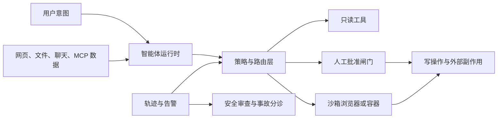

import SupportCTA from "/snippets/support-cta-zh-Hans.mdx";

<SupportCTA />

## 摘要

提示注入让智能体安全变成一个系统设计问题。一旦智能体可以浏览网页、读取
文件、调用连接器，或触发写操作，真正的问题就不再只是“模型能不能识别坏
文本”，而是“哪些不可信输入可以触达哪些危险动作，它们之间有哪些审查与
隔离控制”。

## 为什么这很重要

提示注入不只是提示词质量问题，更是一个架构问题。只要不可信内容与真实能
力相遇，它就会出现。

- 网页、邮件、PDF、聊天记录、连接器返回值和工具输出都可能携带恶意指令。
- 最危险的失败通常发生在 `sources` 加 `sinks` 的组合上：不可信输入触达
  了可以外传数据、改变状态或替用户执行动作的能力。
- 更强的模型行为固然有帮助，但生产系统仍然需要边界、审批和日志，因为总
  会有一部分攻击能够绕过前面的判断。

因此，本周围绕 Lockdown Mode 的安全信号对 handbook 有价值：它把提示注
 入定义为一个控制面问题，而不只是模型聪明程度的问题。

## 心智模型

可以用四步审查：

1. `sources`：不可信内容从哪里进入本次运行
2. `sinks`：哪些工具、连接器或副作用会变得危险
3. `boundaries`：哪些隔离、认证或范围限制挡在它们之间
4. `confirmations`：哪些动作必须在人类批准后才能继续

关键设计动作是预设系统一定会看到恶意内容。目标是确保“看到它”并不会自
 动获得权力。

## 架构图

## 控制栈

### 1. 收缩能力面

对智能体来说，最小权限比对聊天机器人更重要。

- 优先给出狭窄的工具范围，而不是宽泛的“自己想办法访问”。
- 把 MCP `roots` 与 `resources` 当成显式权限边界，而不是便利提示。
- 尽量把敏感读取面与敏感写入面分开。
- 避免让同一次运行同时拥有大范围检索能力和大范围外发动作能力。

OpenAI 的 MCP 指南在这里说得很直接：即便你信任某个 MCP 的开发者，只要
这个 MCP 可能暴露恶意或不可信的用户输入，信任本身也不够。

### 2. 约束执行环境

如果智能体可以浏览或操作界面，那么环境本身就成了防线的一部分。

- 在隔离环境里运行浏览器或 computer-use 流程。
- 把截图、页面文本、PDF、聊天记录和工具输出都视作不可信输入。
- 在自动化 harness 中收紧本地环境变量、扩展和文件访问范围。
- 为高风险流程维护显式的域名与动作 allowlist。

这就是提示注入防御与本地智能体运行时设计之间最实际的桥梁。

### 3. 在真实 sink 前加审批

最重要的审批不是泛泛的“要继续吗？”，而是放在具备持久后果的动作前面。

- 向第三方发送或发布数据
- 在引入不可信内容后继续读取高度敏感的数据源
- 破坏性写入、权限变更、购买或财务动作
- 绕过浏览器或网站安全警告

Lockdown Mode 的意义就在这里：当用户的风险承受度低于功能面时，它为许多
网络能力提供了一个确定性的关闭开关。

### 4. 保留可观测轨迹

如果系统最后只留下“tool ran”这样的记录，那么提示注入防御就等于失败。

- 保留是哪一个 source 引入了内容。
- 记录智能体接下来想调用哪个工具或连接器。
- 记录批准决策和被阻止的动作。
- 保留足够详细的轨迹，支持事故中的 source-to-sink 审查。

这也让安全审查能与 [评估与可观测性](/zh-Hans/systems/evaluation-and-observability)
 形成有用衔接。

## 设计默认项

对面向生产的团队来说，以下默认项通常有帮助：

- 给智能体明确任务，而不是模糊授权。
- 把可信系统指令与检索到的或用户提供的内容分开。
- 在确实需要写路径之前，优先使用只读工具。
- 在外部写入或敏感数据传输前要求确认。
- 为 computer-use 风格流程使用沙箱、容器或隔离浏览器。
- 把连接器和 MCP 的接入视为治理决策，而不是简单的功能开关。

## 当前信号

这次七天文章窗口只贡献了一个直接的 `prompt injection` 标题，因此不应把
这页理解成“整个仓库现在都围绕提示注入”。更合理的解释是：

- OpenAI 当前的安全写作把提示注入描述为针对智能体的 social engineering，
  而不是一个已经解决的字符串过滤问题。
- Lockdown Mode 对所有已登录用户可用，说明产品团队已经把确定性的能力限
  制作为一等控制。
- MCP 指南与安全最佳实践文档，让 trust boundary、scope limit 与 session
  级风险对构建者来说更加具体。

这个组合足以支撑一个耐久的 systems 页面，而不是再写一篇短期雷达笔记。

## 引用

- 官方来源：[Designing AI agents to resist prompt injection](https://openai.com/index/designing-agents-to-resist-prompt-injection/)
- 官方来源：[Understanding prompt injections](https://openai.com/safety/prompt-injections/)
- 官方来源：[ChatGPT release notes: Lockdown Mode availability](https://help.openai.com/en/articles/6825453-chatgpt-release-notes)
- 官方来源：[OpenAI MCP and connectors guidance](https://developers.openai.com/api/docs/guides/tools-connectors-mcp)
- 官方来源：[OpenAI MCP builder guide](https://developers.openai.com/api/docs/mcp)
- 官方来源：[OpenAI computer use guide](https://developers.openai.com/api/docs/guides/tools-computer-use)
- 官方来源：[MCP security best practices](https://modelcontextprotocol.io/docs/tutorials/security/security_best_practices)
- 参考仓库：[openai/codex](https://github.com/openai/codex)
- 参考仓库：[modelcontextprotocol/modelcontextprotocol](https://github.com/modelcontextprotocol/modelcontextprotocol)
- 参考仓库：[promptfoo/promptfoo](https://github.com/promptfoo/promptfoo)

## 延伸阅读

- [协议与互操作](/zh-Hans/systems/protocols-and-interoperability)
- [上下文工程](/zh-Hans/systems/context-engineering)
- [评估与可观测性](/zh-Hans/systems/evaluation-and-observability)
- [本地智能体工具来源地图](/zh-Hans/contributor-kit/reference-notes/local-agent-tooling-source-map)
- [Claude Code Workshop](/zh-Hans/workshops/desktop-agents/claude-code)
- [系统概览](/zh-Hans/systems)

## 更新日志

- 2026-06-07：新增专门的 systems 页面，把提示注入框定为跨 MCP、浏览
  器和本地智能体表面的 source-to-sink containment 问题。
