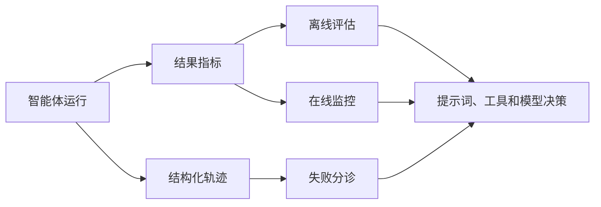

import SupportCTA from "/snippets/support-cta-zh-Hans.mdx";

<SupportCTA />

## 概述

评估告诉你智能体是否足以胜任某项任务。可观测性告诉你它为什么通过或失败。生产系统两者都需要，因为没有轨迹的分数很难改进，而没有指标的轨迹很难优先处理。

## 为什么这很重要

智能体系统是概率性的，并且是多步骤的。这使得它们比确定性软件更难判断。

- 一个正确答案可能依赖搜索、工具或文件状态。
- 同一个任务可能因为截然不同的原因而失败。
- 提示词或模型的变更可能提升某一项能力，却在不知不觉中损害另一项能力。

因此，团队需要两个循环：

- 一个 `evaluation loop` 用于衡量能力
- 一个 `diagnostic loop` 用于解释行为

## 心智模型

把它分成三层来看。

- `offline evaluation`：在已知任务上运行的类基准检查，用于比较提示词、模型、工具和策略。
- `online evaluation`：生产环境信号，例如成功率、延迟、升级率、重试次数或人工覆盖。
- `observability`：轨迹、工具日志、状态转换和产物，用于展示系统实际做了什么。

不同的任务类型需要不同的指标。

- 工具使用通常需要结构化正确性检查，例如函数和参数匹配。
- 通用助手任务通常需要答案级正确性加上任务级完成度。
- 数据生成或综合类任务可能需要对比评审、judge 模型或人工验证。

当前信号还让离线评估内部的另一层拆分变得更有用：

- `spec-driven evals`：把写下来的产品要求或策略约束转成可检查的行为 taxonomy、分层测试样本，以及能够回指原始规则的判定结果。
- `benchmark authoring`：把可移植的任务集和排行榜构建成可以在本地开发流程里编辑、运行和比较的产物。

## 架构图

## 工具版图

导入的参考材料突出了三种有用的评估形态：

- 类基准的工具使用评估，其中结构化匹配用于检查智能体是否选择了正确的函数和参数
- 通用助手评估，其中任务需要多步骤推理和更广泛的成功判断
- 生成质量评估，其中相对比较或人工评审往往比单一精确指标更有用

可观测性应从一开始就保持结构化。

- 保留完整的工具输入和输出。
- 保留失败记录，而不是把它们压缩成通用错误。
- 跟踪步骤顺序、重试和状态变化。
- 让轨迹同时对人和机器都可读。

这就是把黑盒失败变成可操作 bug 的方式。

### 当前评估信号

2026 年 6 月的这组来源，让评估循环比“跑一些 benchmark”更具体：

- `ASSERT` 展示了一条从书面意图到可执行评估的 requirement-driven 路径。真正值得保留的不是产品名，而是这条流水线形状：规范、可编辑 taxonomy、生成场景、完整轨迹，以及可检查的评分结果。
- `Kaggle Benchmarks` 展示了一条 benchmark authoring 路径，它现在可以融入本地开发与 coding agent 工作流，而不再只依赖托管 notebook。这样任务集就更容易和真实应用代码一起版本化、审阅和迭代。
- `开放 eval registry 与 trace grading` 仍然适合团队维护共享基线，但它们应当与产品特定评估并列，而不是取而代之。

这对应一个更实用的默认流程：

1. 先把目标行为写成可供人审阅的形式。
2. 再把这份规范变成可执行 case 或 benchmark task。
3. 运行目标智能体，并保留完整轨迹、工具证据和环境上下文。
4. 在修改提示词、工具或 runtime policy 之前，先看分数，也看失败产物本身。

### Runtime traces 与 control plane 的边界

评估里还有一条经常被混在一起的边界：

- `runtime instrumentation` 用来解释一次运行里到底发生了什么。
- `eval infrastructure` 用来把许多次运行和显式期望做比较。
- `control plane` 用来在组织层面治理一组智能体、环境和策略。

不要把它们并成一个类别。强轨迹并不等于完整 control plane；control plane 也不能替代产品特定 eval。组织级这层可以继续参考 [企业级智能体控制平面](/zh-Hans/contributor-kit/reference-notes/enterprise-agent-control-planes)。

## 权衡

- 离线基准很有用，但它们可能会让系统过度贴合实验室任务，而这些任务比生产现实更干净。
- 在线指标反映真实使用情况，但如果没有良好的分段，它们会滞后且噪声很大。
- Judge 模型评估扩展性很好，但仍然需要人工校准。
- 丰富的轨迹有助于诊断，但也会带来存储、隐私和审查开销。

有用的默认运营原则：

- 评估你实际正在改变的能力
- 把书面策略和产品要求当作评估输入，而不只是背景说明
- 让 benchmark 任务与评分产物足够贴近代码，以便进行版本控制和审阅
- 保留失败和成功运行的轨迹
- 在重写提示词之前先审查失败模式
- 不要把 "tool failed" 作为开发者能看到的唯一解释

## 引用

- 官方来源：[Turn specs into evals for any agent with ASSERT](https://commandline.microsoft.com/assert-written-intent-executable-evals/)
- 官方来源：[Build Kaggle Benchmarks Locally](https://blog.google/innovation-and-ai/technology/developers-tools/build-kaggle--benchmarks-locally/)
- 官方来源：[Build agents you can trust across any framework with open evals and a control standard](https://devblogs.microsoft.com/foundry/build-2026-open-trust-stack-ai-agents/)
- 高信号仓库：[responsibleai/ASSERT](https://github.com/responsibleai/ASSERT)
- 高信号仓库：[openai/evals](https://github.com/openai/evals)

## 延伸阅读

- [企业级智能体控制平面](/zh-Hans/contributor-kit/reference-notes/enterprise-agent-control-planes)
- [客户支持智能体](/zh-Hans/case-studies/customer-support-agents)
- [协议与互操作性](/zh-Hans/systems/protocols-and-interoperability)
- [Deep Research Agents](/zh-Hans/case-studies/deep-research-agents)
- [系统概览](/zh-Hans/systems)

## 更新日志

- 2026-06-06：结合当前 ASSERT 与 Kaggle 来源，补充了 spec-driven eval、local benchmark authoring，以及 control-plane 边界说明。
- 2026-04-21：基于导入的参考材料和实验室重写规则的初始 repo 原生草稿。
